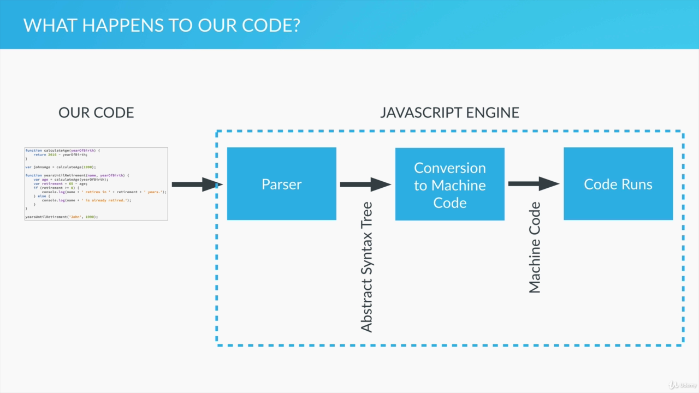
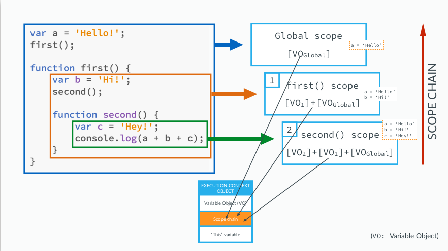
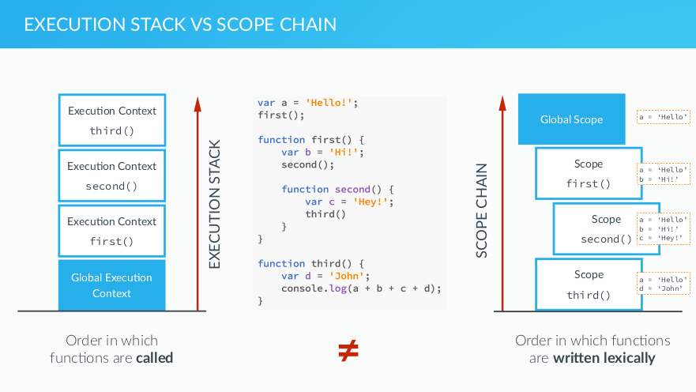

## How JS is executed (Parsers and Engines):

- JS is always hosted in some environment, most typically a browser.
- Other hosts: NodeJS web server, Applications
- Host has JS engine that takes our code and executes it.
- Engines eg: Google's V8 engine (used in chrome), SpiderMonkey, JavaScript Core, and so on.
- Our code is first passed through a parser which reads line by line and validates syntax.
- If the parser finds faults it logs an error else it creates a data structure called abstratct syntax tree which is then translated into the machine code.



## Execution Contexts and the Execution Stack:

#### Execution Context:

- Environment in which the code runs. Think of it as a box, a container, or a wrapper which stores variables and in which a piece of our code is evaluated and executed.
- The default execution context is always the global execution context. The code that is not inside any function, associated with the **global obect**. In the browser, that's the window object.

```js
lastName === window.lastName;
//true
```

- New function get their own execution context. That stacks over the global execution context. All the variables of the function are stored in their execution context.
- At the end of function execution their context is removed(popped from the stack ).

## Execution Contexts in Detail (Creation and Execution Phases and Hoisting):

- Execution context object contains three properties:
  - Variable Objects(VO): Function arguments, Inner Variable Declaration, Function Declaration
  - Scope Chain: Current Variable Objects as well as the VO of all its parents
  - "this" variable
- The execution context in detail:
  - When function is call new execution object is placed on top of the execution stack in two phases:
  - Creation Phase:
    - Creation of Variable Object (VO)
    - Creation of the scope chain
    - Determine value of the this variable
  - Execution Phase
    - The code of the function that generated the current execution context is ran line by line.

### The Variable Object:

1. The argument object is created, containing all the arguments that were passed into the function.
2. Code is scanned for function declarations: for each function, a property is created in the Variable Object, pointing to the function.
3. Code is scanned for variable declarations for each variable, a property is created in the Variable Object, and set to undefined.
   (_note: steps 2 and 3 are called hoisting_)

- functions are stored inside VO even before code starts executing.
- Functions and variables are hoisted in JS, i.e they are available before code execution starts.
- Functions are already defined but variables are undefined when hoisting. Variables will be defined in the execution phase.

### Hoisting in Practice:

```js
// Lecture: Hoisting

calculateAge(1965); // works because of hoisting

function calculateAge(year) {
  console.log(2020 - year);
}

// retirement(1990); // cant use before declaring

var retirement = function (year) {
  console.log(65 - (2020 - year));
};

// Variables hoistings

console.log(age);
//UNDEFINED because hoisting sets variables to undefined
// if variable was not declared then youll see an error

var age = 23;
console.log(age);

function foo() {
  // console.log(age); // undefined
  var age = 65;
  console.log(age);
}

foo();
console.log(age); //23 from global execution context's age
```

## Scoping and the Scope Chain

- Scoping answers the question "where can we access a certain variable?"
- Each new function creates a scope: the space/environment, in which the variables it defines are accessible. (if else, for block does not have scope, only function does)
- Lexical scoping: a function that is lexically within another function gets access to the scope of the outer function.
- 
- 

## The 'this' KEYWORD:

- Variable that each and every execution context gets. It is stored in execution context object.
- In a Regular functon call the this keyword points at the global object,
  (the window object, in the browser).
- In a Method call the this variable points to the object that is calling
  the method.
- The this keyword is not assigned a value until a function where it is
  defined is actually called. Even though this variable is assigned to a object it is assigned a value only when a function of that object is called.

## The 'this' keyword in practice:

```js
// console.log(this); // window object the default object
/*
function calculateAge(year){
    console.log(2020 - year);
    console.log(this); // windows object for regular(not method) function call

}


calculateAge(1996); 
*/

var john = {
  name: "John",
  yearOfBirth: 1990,
  calculateAge: function () {
    console.log(this); // john object
    console.log(2020 - this.yearOfBirth);

    /*
        function innerFunction(){
            console.log(this); 
            //window object since it is regular(not method) function
        }
        innerFunction();
        */
  },
};
john.calculateAge();

var mike = {
  name: "Mike",
  yearOfBirth: 1984,
};

//method borrowing:
mike.calculateAge = john.calculateAge;
mike.calculateAge();
// mike object is this and mike age is logged
// this variable is only assigned a value when
// function is called, else borrowing wouldnt be
// possible, calculateAge would always be john's
```
