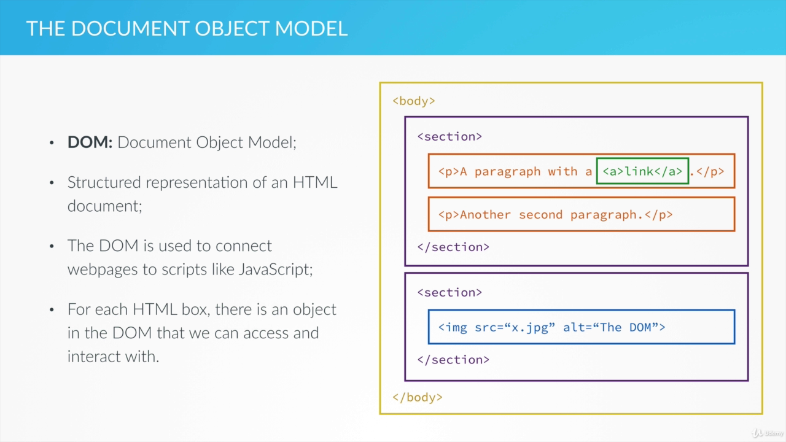

# DOM Manipulation with JS

## DOM: Document object model:

- Structured representation of an HTML document.
- The DOM is used to connect webpages to scripts like JS.
- For each HTML box, there is an object in the DOM that we can access and interact with.



- We can used JS method that allows us to interact and manipulate the DOM and therfore the webpage.
- These methods are attached to some object which is the Document Object, this object gives access to the DOM.

## HTML crash course:

```html
<div class="player-case" id="name-0"></div>
```

- `class` and `id` attribute gives a name to the element but id has to be unique and class name can be shared.
- Connecting CSS in HTML :

  ```html
  <head>
    <link type="text/css" rel="stylesheet" href="style.css" />

    <title>Pig Game</title>
  </head>
  ```

- In css we write rules to style a webpage
- `.classname{}` is defined in css and specified in html
- type selector, `body{}`
- `{}` universal selector.

## DOM Access and Manipulation:

### Things to be Introduced

- How to create our fundamental game variables
- How to generate a random number
- How to manipulate the DOM
- How to read from the DOM
- How to change CSS style

- Random Number:

```js
Math.floor(Math.random() * 6);
// Math.random() generates REAL Number between 0 and 1
// multiplying with 6 converts number to value between 0 and 5
// Math.floor removes decimals
var a = Math.random();
// 0.6949723468351987
Math.floor(a);
// 0
Math.floor(Math.random() * 6) + 1; // generates number between 1 and 6
```

- document object gives access to the DOM. so we are doing `document.methodCall()`
- `document.querySelector()` lets us select stuff exactly like CSS but it only selects the first element that it finds
- `document.querySelector('#current-0').textContent = dice;` - Here `textcontent()` method lets us change the text in the selected element.
- `document.querySelector('#current-'+ activePlayer).textContent = dice;` Here, instead of setting `current-0` id, we can set dynamic number, which is stored in `activeplayer` variable.
- textContent changes the content of the HTML element, but to change the content of the selection there are two ways: Putting Plain text and Putting HTML.
- To put HTML content we use inner HTML methods.
- `document.querySelector('#current-'+activePlayer).innerHTML = '<em>' + dice + '</em>';` Assign the string value to interpret it as HTML code else the parser will think it is a JS code. Now the text is emphasized, i.e. italicized. If textcontent was used every string would be sent as it is.
- Using queryselector to read value from the HTML element : `var x = document.querySelector('#score-0').textContent;`
- to change the CSS of the element using querySelector: `document.querySelector('.dice').style.display='none';` Inline CSS: `style = 'display : none;'` will be added to the element with `class = dice`

## Events and Event Handling:

- **Events**: Notifications that are sent to notify the code that something happened on the webpage.
- Events are triggerred by things like clicking a button, resizing a window, scrolling down or pressing a key
- **Event Listener**: A function that performs an action based on a certain event. It waits for a specific event to happen.
- Action may be responses such as showing animation, pop up window, so on.

### Processing Events:

- Event can only be processed/handled once the execution stack is empty which means that all the functions have returned
- Message Queue: Present in JS engine. Contains all the events ready to be processed when execution stack is empty.
- Once message queue is processed, each event's listener function is called and their execution context is placed in the execution stack.

### Things Introduced:

- How to set up an event Handler
- What a callback function is
- What an anonymous function is
- Another way to select elements by ID
- How to change the image in an `` element

#### Setting Up an event Handler

```js
function btn() {
  // Do Something
}
document.querySelector(".btn-roll").addEventListener("click", btn);
```

- Here we have specified the class of the element (roll dice button in our case)
- we have used addEventListener function to specify type of event , 'click' and the **callback function** name, 'btn'
- [Events Reference MDN](https://developer.mozilla.org/en-US/docs/Web/Events). Click event is a mouse event.
- Usually we call the function as `btn();` but here we are passing function name as argument. This function that we pass is called **callback function** and it is invoked once the event is triggerred by `adEventListener` function. In a nutshell callback function is not directly invoked. It is a function that is supplied to a function and that function invokes them.

#### Anonymous Function:

- We may not want to pass external function's name, in that case we can passed the function definition as an argument. And such function are called Anonymous fuctions.
- It doesn't have a name and cannot be reused.

```js
document.querySelector(".btn-roll").addEventListener("click", function () {
  // do something
});
```

```js
document.querySelector(".btn-roll").addEventListener("click", function () {
  // 1. Random Number
  var dice = Math.floor(Math.random() * 6) + 1;

  //2. Display the result
  // In CSS opposite of display = 'none' is display = 'block'
  // none removes and block brings
  var diceDOM = document.querySelector(".dice");
  diceDOM.style.display = "block";
  // SETTING IMAGES:
  diceDOM.src = "dice-" + dice + ".png"; // dice-1.png present in folder is image source

  //3. Update the round score IF the rolled number was NOT a 1
});
```

- Selecting element by ID :

```js
// selecting element by ID, note the absence of # that
// was present in queryselector when selecting by id
document.getElementById("score-0").textContent = "0";
document.getElementById("score-1").textContent = "0";
document.getElementById("current-0").textContent = "0";
document.getElementById("current-1").textContent = "0";
```

## Updating Scores and Changing the Active Player

### Content:

- What is ternary operator
- How to add, remove and toggle HTML classes.

- Adding classes from javascript:

```js
document.querySelector(".player-0-panel").classList.remove("active");
document.querySelector(".player-1-panel").classList.add("active");
```

- In first line an element identified by player-1-panel class get added an active class but an element with player-0-panel class's active class is removed.
- Toggling :

```js
document.querySelector(".player-0-panel").classList.toggle("active");
document.querySelector(".player-1-panel").classList.toggle("active");
```

- if active class is present then remove, if it is absent then add.

## Implementing Hold Function and the DRY principle

### Content:

- How to use functions to correctly apply the DRY principle
- How to think about the game logic like a programmer.

## Creating a Game initialization Function:

```js
var scores, roundScore, activePlayer;

function init() {
  scores = [0, 0];
  roundScore = 0;
  activePlayer = 0;

  //to change the CSS of the element using querySelector
  document.querySelector(".dice").style.display = "none";

  // selecting element by ID, note the absence of # that
  // was present in queryselector when selecting by id
  document.getElementById("score-0").textContent = "0";
  document.getElementById("score-1").textContent = "0";
  document.getElementById("current-0").textContent = "0";
  document.getElementById("current-1").textContent = "0";

  document.getElementById("name-0").textContent = "Player 1";
  document.getElementById("name-1").textContent = "Player 2";

  document.querySelector(".player-0-panel").classList.remove("winner");
  document.querySelector(".player-1-panel").classList.remove("winner");

  document.querySelector(".player-0-panel").classList.remove("active");
  document.querySelector(".player-1-panel").classList.remove("active");

  document.querySelector(".player-0-panel").classList.add("active");
}
```

## Finishing Touches State Variables:

### Content:

- What is a state variable
- How to use it and why to use it

#### State Variable:

- Tells us the condition of the system
- Used when we need the state of something.
- For eg: we need a state variable for game_on and game_off implying whether game is running or is it over.

_note: querySelector selects only the first item of the class in the list_
