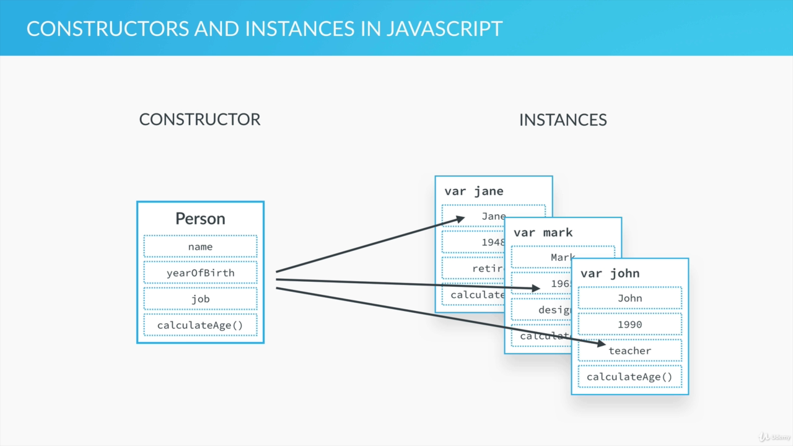
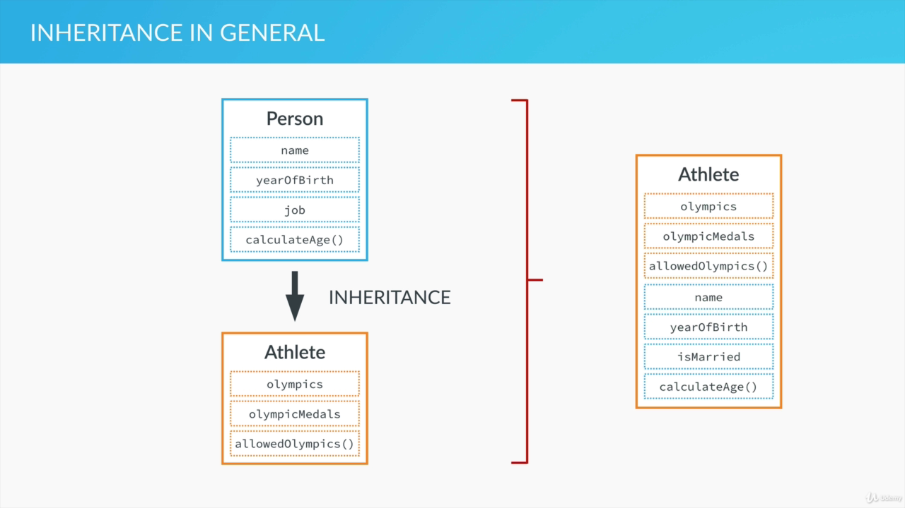
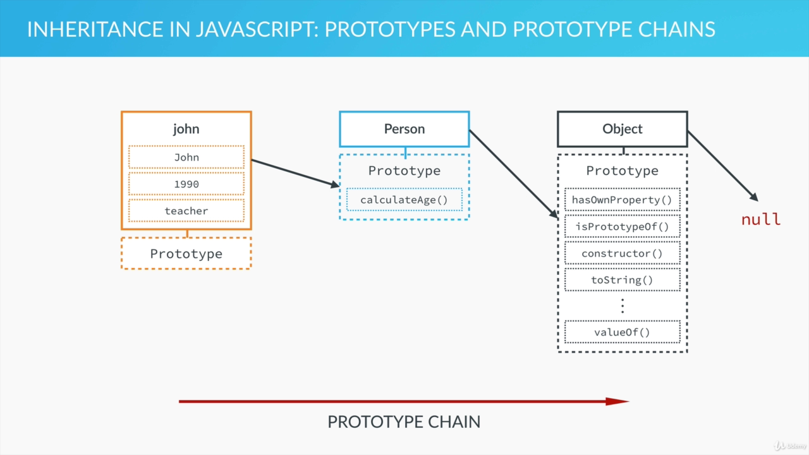

# Advanced JavaScript: Objects and Functions

## Everything is an Object : Inheritance and the Prototype Chain:

- Not everything but almost everything is object in javascript.
- We have two types of data types in javascript: Primitives and Everything Else
- **Primitive:** Numbers, Strings, Booleans, Undefined, Null
- **Everything Else**: Arrays, Functioins, Objects, Dates, Wrappers for Numbers/Strings/Booleans, ... (_They are an object_)

### The Object Oriented Paradigm:

- Objects interact with one another through methods and properties
- Used to store data, structure applications into modules and keeping code clean.
- Instead of declaring individual objects we can create a blueprint

```js
//individual objects
var john = {
  name :'John'
  yearOfBirth: 1998,
  job = 'plumber',
  calculateAge: function(){
    return(2020-this.yearOfBirth);
  }
}
var jane = {
  name :'John'
  yearOfBirth: 1998,
  job = 'writer',
  calculateAge: function(){
    return(2020-this.yearOfBirth);
  }
}
var jane = {
  name :'John'
  yearOfBirth: 1998,
  job = 'technician',
  calculateAge: function(){
    return(2020-this.yearOfBirth);
  }
}

```

### Constructor :

- There exists a Blueprint from which we can make as many object as we want.



- In other programming language they call it class but in JS we often call it a constructor or a prototype.
- A constructor can have as many instances (objects)

### Inheritance in general:

- One object can access another object's properties and methods.
- An athlete can inherit person constructor.
  
- No need to repeat and create same properties in Athlete.

### Inheritance in Javascript: Prototypes and Prototype Chains:

- Each and every JS object has a prototype property which is essential for inheritance
- If John is an instance of Person it inherits some of its property and methods. But for that to have we must add person's p&m inside it's prototype property.
- Person's prototype belongs to all the Person's instances not to plain person constructor.
- Person Constructor inherits the Object Constructor which has a bunch of methods in its prototype property.
- This is called the prototype chain:
  
- When we try to access a certain method/property on an object, JavaScript will first try to find that method on that exact object, if it doesn't find it then checks on its prototype (i.e of its parent) and it moves up until it finds it, if it doesn't find then null object is reached which has no prototype and undefined is returned.

### Summary :

- Every JS object has a prototype property, which makes inheritance possible in JS;
- The prototype property of an object is where we put methods and properties that we want other objects to inherit;
- The Constructor’s prototype property is NOT the prototype of the Constructor itself, it’s the prototype of ALL instances that are created through it;
- When a certain method (or property) is called, the search starts in the object itself, and if it cannot be found, the search moves on to the object’s prototype. This con&nues un&l the method is found: prototype chain.

## Creating Objects Function Constructors:

### Using a function Constructor to create a blueprint:

```js
//function constructor
var Person = function (name, yearOfBirth, job) {
  this.name = name;
  this.yearOfBirth = yearOfBirth;
  this.job = job;
};

// john object instantiation
var john = new Person("John", 1990, "teacher");
```

#### Process (The Legend of new operator :D ) :

- `new` operator creates a brand new empty object.
- then Constructor function ( Person in our case) is called
- Calling a function creates a new executioin context which also has a this variable.
- In regular function call the this variable points to the global object, so the new operator takes care of that and creates a this variable that points to a new empty object.
- When we set the name, birth and job properties that is similar to setting them right on our new empty object.
- If the constructor doesn't return anything then the result is an empty object created by new operator that is assigned to the variable.
- Finally the this variable is able to assign the value to the object that we instantiated.

### Adding function to the constructor:

```js
var Person = function (name, yearOfBirth, job) {
  this.name = name;
  this.yearOfBirth = yearOfBirth;
  this.job = job;
  this.calculateAge = function () {
    console.log(2020 - this.yearOfBirth);
  };
};

// john object instantiation
var john = new Person("John", 1990, "teacher");

john.calculateAge();
```

- logs `30`

### Adding other objects:

```console
> jane
> Person {name: "Jane", yearOfBirth: 1969, job: "Designer", calculateAge: ƒ}
> jane.calculateAge()
> script.js:14 51
```

### Inheritance :

- All the methods and properties that have to inherited should be added in prototype property.
- This is how we do it :

```js
var Person = function (name, yearOfBirth, job) {
  this.name = name;
  this.yearOfBirth = yearOfBirth;
  this.job = job;
  // this.calculateAge = function () {
  //   console.log(2020 - this.yearOfBirth);
  // };
};

Person.prototype.calculateAge = function () {
  console.log(2020 - this.yearOfBirth);
};

// john object instantiation
var john = new Person("John", 1990, "teacher");

john.calculateAge(); // 30
```

- Although it is not that common, we can also add properties to prototype

```js
Person.prototype.lastName = "Smith";
var john = new Person("John", 1990, "teacher");
console.log(john.lastName); // Smith
```
