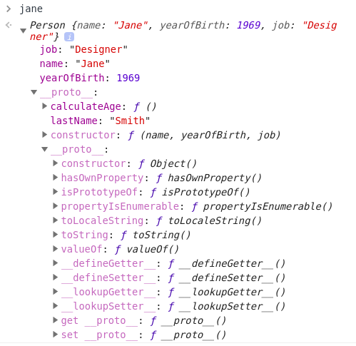
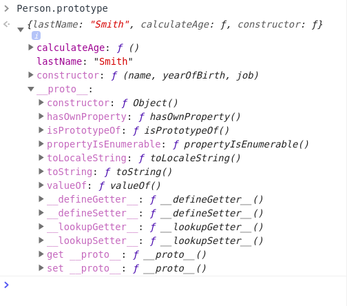
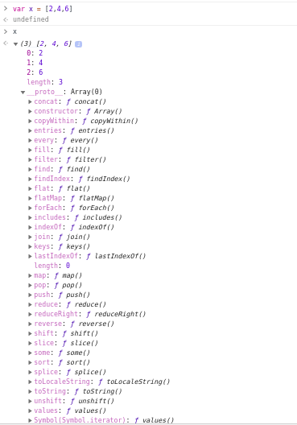
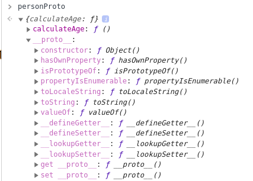
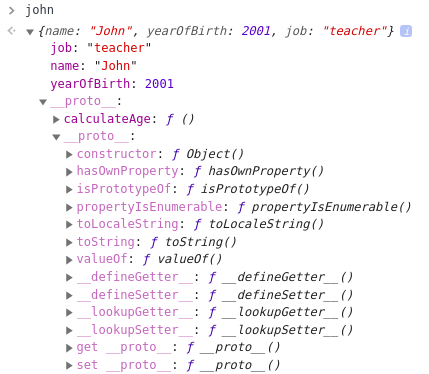
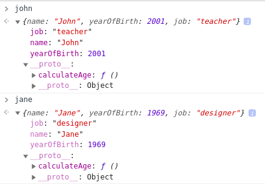
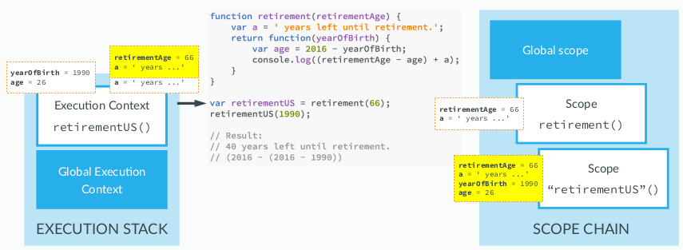

# Advanced JavaScript: Objects and Functions

## Everything is an Object : Inheritance and the Prototype Chain:

- Not everything but almost everything is object in javascript.
- We have two types of data types in javascript: Primitives and Everything Else
- **Primitive:** Numbers, Strings, Booleans, Undefined, Null
- **Everything Else**: Arrays, Functioins, Objects, Dates, Wrappers for Numbers/Strings/Booleans, ... (_They are an object_)

### The Object Oriented Paradigm:

- Objects interact with one another through methods and properties
- Used to store data, structure applications into modules and keeping code clean.
- Instead of declaring individual objects we can create a blueprint

```js
//individual objects
var john = {
  name :'John'
  yearOfBirth: 1998,
  job = 'plumber',
  calculateAge: function(){
    return(2020-this.yearOfBirth);
  }
}
var jane = {
  name :'John'
  yearOfBirth: 1998,
  job = 'writer',
  calculateAge: function(){
    return(2020-this.yearOfBirth);
  }
}
var jane = {
  name :'John'
  yearOfBirth: 1998,
  job = 'technician',
  calculateAge: function(){
    return(2020-this.yearOfBirth);
  }
}

```

### Constructor :

- There exists a Blueprint from which we can make as many object as we want.


- In other programming language they call it class but in JS we often call it a constructor or a prototype.
- A constructor can have as many instances (objects)

### Inheritance in general:

- One object can access another object's properties and methods.
- An athlete can inherit person constructor.
  
- No need to repeat and create same properties in Athlete.

### Inheritance in Javascript: Prototypes and Prototype Chains:

- Each and every JS object has a prototype property which is essential for inheritance
- If John is an instance of Person it inherits some of its property and methods. But for that to have we must add person's p&m inside it's prototype property.
- Person's prototype belongs to all the Person's instances not to plain person constructor.
- Person Constructor inherits the Object Constructor which has a bunch of methods in its prototype property.
- This is called the prototype chain:
  
- When we try to access a certain method/property on an object, JavaScript will first try to find that method on that exact object, if it doesn't find it then checks on its prototype (i.e of its parent) and it moves up until it finds it, if it doesn't find then null object is reached which has no prototype and undefined is returned.

### Summary :

- Every JS object has a prototype property, which makes inheritance possible in JS;
- The prototype property of an object is where we put methods and properties that we want other objects to inherit;
- The Constructor’s prototype property is NOT the prototype of the Constructor itself, it’s the prototype of ALL instances that are created through it;
- When a certain method (or property) is called, the search starts in the object itself, and if it cannot be found, the search moves on to the object’s prototype. This con&nues un&l the method is found: prototype chain.

## Creating Objects Function Constructors:

### Using a function Constructor to create a blueprint:

```js
//function constructor
var Person = function (name, yearOfBirth, job) {
  this.name = name;
  this.yearOfBirth = yearOfBirth;
  this.job = job;
};

// john object instantiation
var john = new Person("John", 1990, "teacher");
```

#### Process (The Legend of new operator :D ) :

- `new` operator creates a brand new empty object.
- then Constructor function ( Person in our case) is called
- Calling a function creates a new executioin context which also has a this variable.
- In regular function call the this variable points to the global object, so the new operator takes care of that and creates a this variable that points to a new empty object.
- When we set the name, birth and job properties that is similar to setting them right on our new empty object.
- If the constructor doesn't return anything then the result is an empty object created by new operator that is assigned to the variable.
- Finally the this variable is able to assign the value to the object that we instantiated.

### Adding function to the constructor:

```js
var Person = function (name, yearOfBirth, job) {
  this.name = name;
  this.yearOfBirth = yearOfBirth;
  this.job = job;
  this.calculateAge = function () {
    console.log(2020 - this.yearOfBirth);
  };
};

// john object instantiation
var john = new Person("John", 1990, "teacher");

john.calculateAge();
```

- logs `30`

### Adding other objects:

```console
> jane
> Person {name: "Jane", yearOfBirth: 1969, job: "Designer", calculateAge: ƒ}
> jane.calculateAge()
> script.js:14 51
```

### Inheritance :

- All the methods and properties that have to inherited should be added in prototype property.
- This is how we do it :

```js
var Person = function (name, yearOfBirth, job) {
  this.name = name;
  this.yearOfBirth = yearOfBirth;
  this.job = job;
  // this.calculateAge = function () {
  //   console.log(2020 - this.yearOfBirth);
  // };
};

Person.prototype.calculateAge = function () {
  console.log(2020 - this.yearOfBirth);
};

// john object instantiation
var john = new Person("John", 1990, "teacher");

john.calculateAge(); // 30
```

- Although it is not that common, we can also add properties to prototype

```js
Person.prototype.lastName = "Smith";
var john = new Person("John", 1990, "teacher");
console.log(john.lastName); // Smith
```

## The Prototype Chain in the Console:

### Checking prototype Chain in Browser:

- Go to the console and type jane
- Review for jane:

```js
var Person = function (name, yearOfBirth, job) {
  this.name = name;
  this.yearOfBirth = yearOfBirth;
  this.job = job;
};
Person.prototype.lastName = "Smith";

Person.prototype.calculateAge = function () {
  console.log(2020 - this.yearOfBirth);
};

var jane = new Person("Jane", 1969, "Designer");
```

- What console showed:
  

- Similarly for `Person.prototype` we have the following result:
  

- Also we can observe:

```console
john.__proto__ === Person.prototype
true
```

- prototype of john is the prototype of Person function constructor
- We can also observe the proto inside of proto which is the prototype of Object object which is ancestor of all other objects.
- SO we can also use the object's methods

### Testing object functions:

```console
john.hasOwnProperty('job')
true
john.hasOwnProperty('lastName')
false

john instanceof Person
true
```

- here lastName is not john's own property so it is false
- job is john own property so `hasOwnProperty` returns true
- instanceof operator checks whether john is person's instance

### Almost everything is an object:

- Checking out arrays as an object:
  
- We can see all the methods and properties of array data type here. We can also see parent prototype formed with a prototype chain.
- All these methods of Arrays are stored in their prototype.

## Creating Objects with Object.create method

- Another way to create object that inherit from the prototype using `Object.create` method will be discussed here.
- We'll first define an object that will later act as a prototype for creating new object.

### Here is the example code:

```js
var personProto = {
  calculateAge: function () {
    console.log(2020 - this.yearOfBirth);
  },
};

var john = Object.create(personProto);
john.name = "John";
john.yearOfBirth = 2001;
john.job = "teacher";
```

#### Person Prototype:



#### John Prototype:



### Alternative way of creating property:

- We pass value in a rather eccentric way as a second argument to the create function.
- value (key) and value literal pair is passed

```js
var jane = Object.create(personProto, {
  name: { value: "Jane" },
  yearOfBirth: { value: 1969 },
  job: { value: "designer" },
});
```

#### Difference between john and jane:



- As we can see, john and jane may have different approaches, but their prototype is same.

### Difference between object.create and function constructor:

- Former creates an object that inherits directly from the prototype that we pass into the first argument.
- The latter is a constructor with a prototype property which the new object inherits.
- One benefit of Object.create is that we can explicitly specify which object we are going to inherit.

## Primitives vs Objects:

- **Primitives**: Numbers, boolean, strings, undefined and null
- Variable containing primitive hold the value inside the variable itself
- Variable associated with the object do not contain the object but instead they contain reference to the place in the memory where the object sits/stored. Sort of like pointer

### Example Code:

```js
var a = 23;
var b = a;

a = 46;
console.log(a, b); // 46 23

var obj1 = {
  name: "john",
  age: 26,
};

var obj2 = obj1;

obj1.age = 30;

console.log(obj1.age + " " + obj2.age); // 30 30
```

### With Function and its scope of an object:

- When we pass primitive to a function a simple copy is created but when we pass a object, a reference is only passed.
- Changing object inside changes its original value.

```js
// Functions
var age = 27;
var obj = {
  name: "Jonas",
  city: "Lisbon",
};

function change(a, b) {
  a = 30;
  b.city = "San Fransisco";
}

change(age, obj);
console.log(age); // 27
console.log(obj.city); // San Francisco
```

## First Class Functions Passing Functions as Arguments:

- Functions are also objects in JavaScript
- With functions we can also do the same thing that we can do with objects

### Functions are also Objects in JavaScript: (First Class Functions)

- A function is an instance of the Object type;
- A function behaves like any other object;
- We can store functions in a variable;
- We can pass a function as an argument to another function;
- We can return a function from a function.

### A demo exampe of passing function as an argument:

- We want to perform calculation based on the value of the array:
- We could write a huge calculation function or follow an alternative approach
- We pass an array to a function and that function returns an array after calculation, but we also pass the function using which the called function must make the calculation:

```js
var years = [1990, 1966, 1937, 2005, 1998];

// Generic Function
function arrayCalc(arr, fn) {
  var arrResult = [];
  for (var i = 0; i < arr.length; i++) {
    arrResult.push(fn(arr[i]));
  }
  return arrResult;
}

// Callback functions : passed as argument to general function
function calculateAge(el) {
  return 2020 - el;
}

function isFullAge(el) {
  return el >= 18;
}

function maxHeartRate(el) {
  if (el >= 18 && el <= 81) {
    return Math.round(206.9 - 0.67 * el);
  } else {
    return -1;
  }
}

console.log(years); // (5) [1990, 1966, 1937, 2005, 1998]

// Calculating the age with arrayCalc and calculateAge
ageArr = arrayCalc(years, calculateAge);
console.log(ageArr); // (5) [30, 54, 83, 15, 22]

// Calculating the age with arrayCalc and isFullAge
var fullAges = arrayCalc(ageArr, isFullAge);
console.log(fullAges); // (5) [true, true, true, false, true]

// Calculating the age with arrayCalc and maxHeartRate
var rates = arrayCalc(ageArr, maxHeartRate);
console.log(rates); // (5) [187, 171, -1, -1, 192]
```

## First Class Functions Returning Functions:

- We are going to create a function that creates different sets of questio for different jobs.
- For each job we'll return a function that builds string using the person's name as an input.

```js
function interviewQuestion(job) {
  if (job == "designer") {
    // anonynomous function (doesn't have name)
    return function (name) {
      console.log(name + ", can you please explain what UX design is?");
    };
  } else if (job == "teacher") {
    return function (name) {
      console.log("What subject do you teach " + name + " ?");
    };
  } else {
    return function (name) {
      console.log("Hello " + name + ", what do you do?");
    };
  }
}

// this variable is now a function, similar to function expression
var teacherQuestion = interviewQuestion("teacher");
teacherQuestion(); // What subject do you teach john ?

var designerQuestion = interviewQuestion("designer");
designerQuestion("john"); // john, can you please explain what UX design is?
```

- This is possible because first class function are objects and we are returning an object

### Alternate way:

```js
interviewQuestion("teacher")("Mark"); //What subject do you teach Mark ?
```

- this works because it is evaluated from left to right.
- interviewQuestion creates An anonymous function for teacher and it is called with an argument of mark

## Immediately Invoked Function Expressioins (IIFE):

- Extremely common pattern in JS

### A game example:

- win : random score (0-9) > 5, else lose
- Hide the score
- Typicaly a simple function would do the trick
- But just for the sake of private data (scoped data), we shouldn't always go to functions.
- That is where IIFE comes in.

### IIFE syntax:

```js
(function () {
  var score = Math.random() * 10;
  console.log(score >= 5);
})(); // true
```

- Just writing `function(){...}` would yeild an error because it is function declaration without a name. We'd get the following error:

```js
script.js:193 Uncaught SyntaxError: Function statements require a function name
```

- However we can trick the parser by wrapping the nameless function(or anonynomous function) by a paranthesis.
- Here we cannot access score variable from outside. So we created a data privacy here.

### Passing an argument (goodluck):

```js
(function (goodluck) {
  var score = Math.random() * 10;
  console.log(score >= 5 - goodluck);
})(5); // true
```

### IIFE Use Case:

- We can call IIFE only once
- So, the usecase is just that, we want to create a new scope that is hidden from outer scope.
- We get data privacy and dont interfere with other variables in the execution context.

## Closures:

### Demo Function:

- We are creating an inner function to calculate age until retirement:

```js
function retirement(retirementAge) {
  var a = " years left until retirement.";
  return function (yearOfBirth) {
    var age = 2020 - yearOfBirth;
    console.log(retirementAge - age + a);
  };
}

var retirementUS = retirement(66);
retirementUS(1960); // 6 years left until retirement.

retirement(66)(1990); // 36 years left until retirement.
```

#### Steps:

- We call the retirement function and pass 66 as an argument
- function then creates `var a` in its execution stack.
- then it returns the function and then pops its execution context from stack.
- we stored returned function in retirementUS
- But the inner function has used the variable (**a**) and parameter(**retirementAge**) of its outer function and when the stack is popped we shouldn't be able to access them. But we are able to do so.

### This is the closure:

- An inner function always has access to the variables and parameters of its outer function, even after the outer function has returned.
- Working:
  

- Since the inner function is still in stack it's parent function Variable Object remains in the scope chain long after the parent function has completed its execution.
- The current execution context has closed-in on the outer variable object, so it can use it. That is why it is called closure.
- We dont create closure manually they are in built into JS.

### Use Case;

```js
function retirement(retirementAge) {
  var a = " years left until retirement.";
  return function (yearOfBirth) {
    var age = 2020 - yearOfBirth;
    console.log(retirementAge - age + a);
  };
}

var retirementUS = retirement(66);
var retirementGermany = retirement(65);
var retirementIceland = retirement(67);

retirementUS(1990); // 36 years left until retirement.
retirementGermany(1990); // 35 years left until retirement.
retirementIceland(1990); // 37 years left until retirement.
```

### ASSIGNMENT(Section 9's Function in new way; only one inner function)

- There is only one inner function
- Decision is taken in a inner function

```js
function interviewQuestion(job) {
  return function (name) {
    if (job === "teacher") {
      console.log("What subject do you teach " + name + " ?");
    } else if (job === "designer") {
      console.log(name + ", can you please explain what UX design is?");
    } else {
      console.log("Hello " + name + ", what do you do?");
    }
  };
}

// this variable is now a function, similar to function expression
var designerQuestion = interviewQuestion("designer");
designerQuestion("john"); // john can you please explain what UX design is?

var teacherQuestion = interviewQuestion("teacher");
teacherQuestion("jane"); // What subject do you teach jane ?

interviewQuestion("designer")("mark"); //mark can you please explain what UX design is?
```

- `interviewQuestion("designer");` returns an anonynomous function and assigns to `designerQuestion`.
- We call `designerQuestion` with "john" argument. And then the execution context will close in over the variable object of the function that we had before. It will close in the variable(`job`) that we defined in the parent function.
