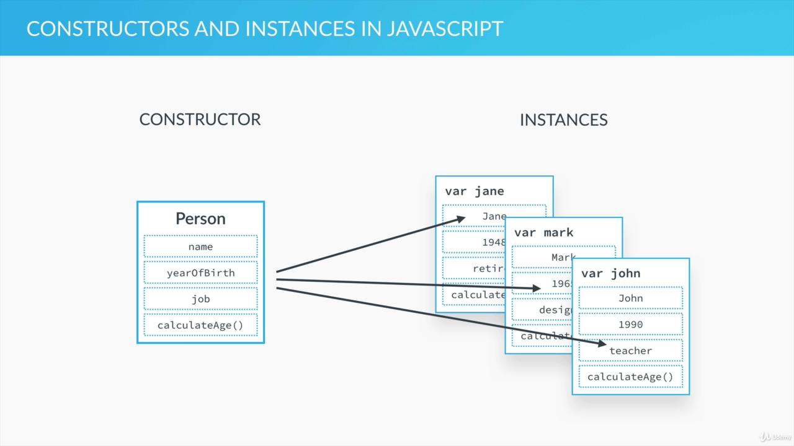

# Part 1:

## Everything is an Object : Inheritance and the Prototype Chain:

- Not everything but almost everything is object in javascript.
- We have two types of data types in javascript: Primitives and Everything Else
- **Primitive:** Numbers, Strings, Booleans, Undefined, Null
- **Everything Else**: Arrays, Functioins, Objects, Dates, Wrappers for Numbers/Strings/Booleans, ... (_They are an object_)

### The Object Oriented Paradigm:

- Objects interact with one another through methods and properties
- Used to store data, structure applications into modules and keeping code clean.
- Instead of declaring individual objects we can create a blueprint

```js
//individual objects
var john = {
  name :'John'
  yearOfBirth: 1998,
  job = 'plumber',
  calculateAge: function(){
    return(2020-this.yearOfBirth);
  }
}
var jane = {
  name :'John'
  yearOfBirth: 1998,
  job = 'writer',
  calculateAge: function(){
    return(2020-this.yearOfBirth);
  }
}
var jane = {
  name :'John'
  yearOfBirth: 1998,
  job = 'technician',
  calculateAge: function(){
    return(2020-this.yearOfBirth);
  }
}

```

### Constructor :

- There exists a Blueprint from which we can make as many object as we want.



- In other programming language they call it class but in JS we often call it a constructor or a prototype.
- A constructor can have as many instances (objects)

### Inheritance in general:

- One object can access another object's properties and methods.
- An athlete can inherit person constructor.
  
- No need to repeat and create same properties in Athlete.

### Inheritance in Javascript: Prototypes and Prototype Chains:

- Each and every JS object has a prototype property which is essential for inheritance
- If John is an instance of Person it inherits some of its property and methods. But for that to have we must add person's p&m inside it's prototype property.
- Person's prototype belongs to all the Person's instances not to plain person constructor.
- Person Constructor inherits the Object Constructor which has a bunch of methods in its prototype property.
- This is called the prototype chain:
  
- When we try to access a certain method/property on an object, JavaScript will first try to find that method on that exact object, if it doesn't find it then checks on its prototype (i.e of its parent) and it moves up until it finds it, if it doesn't find then null object is reached which has no prototype and undefined is returned.

### Summary :

- Every JS object has a prototype property, which makes inheritance possible in JS;
- The prototype property of an object is where we put methods and properties that we want other objects to inherit;
- The Constructor’s prototype property is NOT the prototype of the Constructor itself, it’s the prototype of ALL instances that are created through it;
- When a certain method (or property) is called, the search starts in the object itself, and if it cannot be found, the search moves on to the object’s prototype. This con&nues un&l the method is found: prototype chain.

## Creating Objects Function Constructors:

### Using a function Constructor to create a blueprint:

```js
//function constructor
var Person = function (name, yearOfBirth, job) {
  this.name = name;
  this.yearOfBirth = yearOfBirth;
  this.job = job;
};

// john object instantiation
var john = new Person("John", 1990, "teacher");
```

#### Process (The Legend of new operator :D ) :

- `new` operator creates a brand new empty object.
- then Constructor function ( Person in our case) is called
- Calling a function creates a new execution context which also has a this variable.
- In regular function call the this variable points to the global object, so the new operator takes care of that and creates a this variable that points to a new empty object.
- When we set the name, birth and job properties that is similar to setting them right on our new empty object.
- If the constructor doesn't return anything then the result is an empty object created by new operator that is assigned to the variable.
- Finally the this variable is able to assign the value to the object that we instantiated.

### Adding function to the constructor:

```js
var Person = function (name, yearOfBirth, job) {
  this.name = name;
  this.yearOfBirth = yearOfBirth;
  this.job = job;
  this.calculateAge = function () {
    console.log(2020 - this.yearOfBirth);
  };
};

// john object instantiation
var john = new Person("John", 1990, "teacher");

john.calculateAge();
```

- logs `30`

- Checking in browser :


### Adding other objects:

```console
> jane
> Person {name: "Jane", yearOfBirth: 1969, job: "Designer", calculateAge: ƒ}
> jane.calculateAge()
> 51
```

### Inheritance :

- All the methods and properties that can be inherited should be added in prototype property.
- This is how we do it :

```js
var Person = function (name, yearOfBirth, job) {
  this.name = name;
  this.yearOfBirth = yearOfBirth;
  this.job = job;
  // this.calculateAge = function () {
  //   console.log(2020 - this.yearOfBirth);
  // };
};

Person.prototype.calculateAge = function () {
  console.log(2020 - this.yearOfBirth);
};

// john object instantiation
var john = new Person("John", 1990, "teacher");

john.calculateAge(); // 30
```

- Although it is not that common, we can also add properties to prototype

```js
Person.prototype.lastName = "Smith";
var john = new Person("John", 1990, "teacher");
console.log(john.lastName); // Smith
```

## The Prototype Chain in the Console:

### Checking prototype Chain in Browser:

- Go to the console and type jane
- Review for jane:

```js
var Person = function (name, yearOfBirth, job) {
  this.name = name;
  this.yearOfBirth = yearOfBirth;
  this.job = job;
};
Person.prototype.lastName = "Smith";

Person.prototype.calculateAge = function () {
  console.log(2020 - this.yearOfBirth);
};

var jane = new Person("Jane", 1969, "Designer");
```

- What console showed:


- Similarly for `Person.prototype` we have the following result:


- Also we can observe:

```console
john.__proto__ === Person.prototype
true
```

- prototype of john is the prototype of Person function constructor
- We can also observe the proto inside of proto which is the prototype of Object object which is ancestor of all other objects.
- SO we can also use the object's methods

### Testing object functions:

```console
john.hasOwnProperty('job')
true
john.hasOwnProperty('lastName')
false

john instanceof Person
true
```

- here lastName is not john's own property so it is false
- job is john own property so `hasOwnProperty` returns true
- instanceof operator checks whether john is person's instance

### Almost everything is an object:

- Checking out arrays as an object:

  

- We can see all the methods and properties of array data type here. We can also see parent prototype formed with a prototype chain.
- All these methods of Arrays are stored in their prototype.

## Creating Objects with Object.create method

- Another way to create object that inherit from the prototype using `Object.create` method will be discussed here.
- We'll first define an object that will later act as a prototype for creating new object.

### Here is the example code:

```js
var personProto = {
  calculateAge: function () {
    console.log(2020 - this.yearOfBirth);
  },
};

var john = Object.create(personProto);
john.name = "John";
john.yearOfBirth = 2001;
john.job = "teacher";
```

#### Person Prototype:


#### John Prototype:


### Alternative way of creating property:

- We pass value in a rather eccentric way as a second argument to the create function.
- value (key) and value literal pair is passed

```js
var jane = Object.create(personProto, {
  name: { value: "Jane" },
  yearOfBirth: { value: 1969 },
  job: { value: "designer" },
});
```

#### Difference between john and jane:


- As we can see, john and jane may have different approaches, but their prototype is same.

### Difference between object.create and function constructor:

- Former creates an object that inherits directly from the prototype that we pass into the first argument.
- The latter is a constructor with a prototype property which the new object inherits.
- One benefit of Object.create is that we can explicitly specify which object we are going to inherit.

## Primitives vs Objects:

- **Primitives**: Numbers, boolean, strings, undefined and null
- Variable containing primitive hold the value inside the variable itself
- Variable associated with the object do not contain the object but instead they contain reference to the place in the memory where the object sits/stored. Sort of like pointer

### Example Code:

```js
var a = 23;
var b = a;

a = 46;
console.log(a, b); // 46 23

var obj1 = {
  name: "john",
  age: 26,
};

var obj2 = obj1;

obj1.age = 30;

console.log(obj1.age + " " + obj2.age); // 30 30
```

### With Function and its scope of an object:

- When we pass primitive to a function a simple copy is created but when we pass a object, a reference is only passed.
- Changing object inside changes its original value.

```js
// Functions
var age = 27;
var obj = {
  name: "Jonas",
  city: "Lisbon",
};

function change(a, b) {
  a = 30;
  b.city = "San Fransisco";
}

change(age, obj);
console.log(age); // 27
console.log(obj.city); // San Francisco
```

## Here's the link to part 2: [part 2 link](part2.md)
