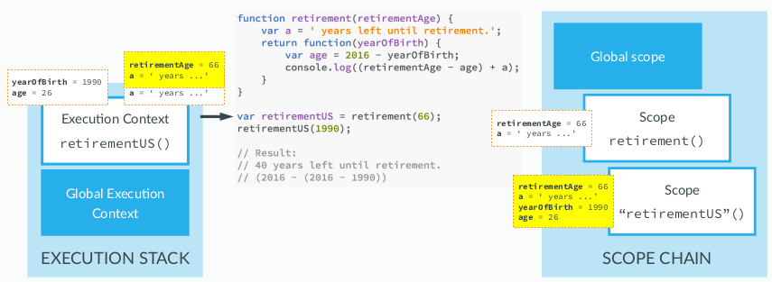

# Part 2:

## First Class Functions Passing Functions as Arguments:

- Functions are also objects in JavaScript
- With functions we can also do the same thing that we can do with objects

### Functions are also Objects in JavaScript: (First Class Functions)

- A function is an instance of the Object type;
- A function behaves like any other object;
- We can store functions in a variable;
- We can pass a function as an argument to another function;
- We can return a function from a function.

### A demo exampe of passing function as an argument:

- We want to perform calculation based on the value of the array:
- We could write a huge calculation function or follow an alternative approach
- We pass an array to a function and that function returns an array after calculation, but we also pass the function using which the called function must make the calculation:

```js
var years = [1990, 1966, 1937, 2005, 1998];

// Generic Function
function arrayCalc(arr, fn) {
  var arrResult = [];
  for (var i = 0; i < arr.length; i++) {
    arrResult.push(fn(arr[i]));
  }
  return arrResult;
}

// Callback functions : passed as argument to general function
function calculateAge(el) {
  return 2020 - el;
}

function isFullAge(el) {
  return el >= 18;
}

function maxHeartRate(el) {
  if (el >= 18 && el <= 81) {
    return Math.round(206.9 - 0.67 * el);
  } else {
    return -1;
  }
}

console.log(years); // (5) [1990, 1966, 1937, 2005, 1998]

// Calculating the age with arrayCalc and calculateAge
ageArr = arrayCalc(years, calculateAge);
console.log(ageArr); // (5) [30, 54, 83, 15, 22]

// Calculating the age with arrayCalc and isFullAge
var fullAges = arrayCalc(ageArr, isFullAge);
console.log(fullAges); // (5) [true, true, true, false, true]

// Calculating the age with arrayCalc and maxHeartRate
var rates = arrayCalc(ageArr, maxHeartRate);
console.log(rates); // (5) [187, 171, -1, -1, 192]
```

## First Class Functions Returning Functions:

- We are going to create a function that creates different sets of questio for different jobs.
- For each job we'll return a function that builds string using the person's name as an input.

```js
function interviewQuestion(job) {
  if (job == "designer") {
    // anonynomous function (doesn't have name)
    return function (name) {
      console.log(name + ", can you please explain what UX design is?");
    };
  } else if (job == "teacher") {
    return function (name) {
      console.log("What subject do you teach " + name + " ?");
    };
  } else {
    return function (name) {
      console.log("Hello " + name + ", what do you do?");
    };
  }
}

// this variable is now a function, similar to function expression
var teacherQuestion = interviewQuestion("teacher");
teacherQuestion(); // What subject do you teach john ?

var designerQuestion = interviewQuestion("designer");
designerQuestion("john"); // john, can you please explain what UX design is?
```

- This is possible because first class function are objects and we are returning an object

### Alternate way:

```js
interviewQuestion("teacher")("Mark"); //What subject do you teach Mark ?
```

- this works because it is evaluated from left to right.
- interviewQuestion creates An anonymous function for teacher and it is called with an argument of mark

## Immediately Invoked Function Expressioins (IIFE):

- Extremely common pattern in JS

### A game example:

- win : random score (0-9) > 5, else lose
- Hide the score
- Typicaly a simple function would do the trick
- But just for the sake of private data (scoped data), we shouldn't always go to functions.
- That is where IIFE comes in.

### IIFE syntax:

```js
(function () {
  var score = Math.random() * 10;
  console.log(score >= 5);
})(); // true
```

- Just writing `function(){...}` would yeild an error because it is function declaration without a name. We'd get the following error:

```js
script.js:193 Uncaught SyntaxError: Function statements require a function name
```

- However we can trick the parser by wrapping the nameless function(or anonynomous function) by a paranthesis.
- Here we cannot access score variable from outside. So we created a data privacy here.

### Passing an argument (goodluck):

```js
(function (goodluck) {
  var score = Math.random() * 10;
  console.log(score >= 5 - goodluck);
})(5); // true
```

### IIFE Use Case:

- We can call IIFE only once
- So, the usecase is just that, we want to create a new scope that is hidden from outer scope.
- We get data privacy and dont interfere with other variables in the execution context.

## Closures:

### Demo Function:

- We are creating an inner function to calculate age until retirement:

```js
function retirement(retirementAge) {
  var a = " years left until retirement.";
  return function (yearOfBirth) {
    var age = 2020 - yearOfBirth;
    console.log(retirementAge - age + a);
  };
}

var retirementUS = retirement(66);
retirementUS(1960); // 6 years left until retirement.

retirement(66)(1990); // 36 years left until retirement.
```

#### Steps:

- We call the retirement function and pass 66 as an argument
- function then creates `var a` in its execution stack.
- then it returns the function and then pops its execution context from stack.
- we stored returned function in retirementUS
- But the inner function has used the variable (**a**) and parameter(**retirementAge**) of its outer function and when the stack is popped we shouldn't be able to access them. But we are able to do so.

### This is the closure:

- An inner function always has access to the variables and parameters of its outer function, even after the outer function has returned.
- Working:
  

- Since the inner function is still in stack it's parent function Variable Object remains in the scope chain long after the parent function has completed its execution.
- The current execution context has closed-in on the outer variable object, so it can use it. That is why it is called closure.
- We dont create closure manually they are in built into JS.

### Use Case;

```js
function retirement(retirementAge) {
  var a = " years left until retirement.";
  return function (yearOfBirth) {
    var age = 2020 - yearOfBirth;
    console.log(retirementAge - age + a);
  };
}

var retirementUS = retirement(66);
var retirementGermany = retirement(65);
var retirementIceland = retirement(67);

retirementUS(1990); // 36 years left until retirement.
retirementGermany(1990); // 35 years left until retirement.
retirementIceland(1990); // 37 years left until retirement.
```

### ASSIGNMENT(Section 9's Function in new way; only one inner function)

- There is only one inner function
- Decision is taken inside a inner function

```js
function interviewQuestion(job) {
  return function (name) {
    if (job === "teacher") {
      console.log("What subject do you teach " + name + " ?");
    } else if (job === "designer") {
      console.log(name + ", can you please explain what UX design is?");
    } else {
      console.log("Hello " + name + ", what do you do?");
    }
  };
}

// this variable is now a function, similar to function expression
var designerQuestion = interviewQuestion("designer");
designerQuestion("john"); // john can you please explain what UX design is?

var teacherQuestion = interviewQuestion("teacher");
teacherQuestion("jane"); // What subject do you teach jane ?

interviewQuestion("designer")("mark"); //mark can you please explain what UX design is?
```

- `interviewQuestion("designer");` returns an anonynomous function and assigns to `designerQuestion`.
- We call `designerQuestion` with "john" argument. And then the execution context will close in over the variable object of the function that we had before. It will close in the variable(`job`) that we defined in the parent function.

## Bind, Call and Apply methods:

- Function are special objects and just like array object, function also get a set of method which they inherit from function constructor object.
- These method allow us to call a function and set the `this` variable manually

### A Simple Example:

```js
var john = {
  name: "John",
  age: 28,
  job: "teacher",
  presentation: function (style, timeOfDay) {
    if (style === "formal") {
      console.log(
        "Good " +
          timeOfDay +
          ", Ladies and gentlemen! I'm " +
          this.name +
          ", I'm a " +
          this.job +
          " and I'm " +
          this.age +
          " years old."
      );
    } else if (style === "friendly") {
      console.log(
        "Hey! What's up? I'm " +
          this.name +
          ", I'm a " +
          this.job +
          " and I'm " +
          this.age +
          " years old. Have a nice " +
          timeOfDay +
          "."
      );
    }
  },
};

var emily = {
  name: "Emily",
  age: 35,
  job: "designer",
};

john.presentation("formal", "morning"); // Good morning, Ladies and gentlemen! I'm John, I'm a teacher and I'm 28 years old.
```

- Suppose we want to call presentation method for emily. How do we do that? You use the `call()` method.
- the first argument of the call method is always to set the **this** variable.

```js
john.presentation.call(emily, "friendly", "afternoon"); // Hey! What's up? I'm Emily, I'm a designer and I'm 35 years old. Have a nice afternoon.
```

- SO now the this variable in presentation function will point to emily and the this.job in presentation will be the value of emily's job and not john's job.

- **This is called method borrowing**, we borrowed john's method and set the this variable of presentation function to point to the emily object.
- When you again call the method, this is switched to john:

```js
john.presentation("formal", "evening"); // Good evening, Ladies and gentlemen! I'm John, I'm a teacher and I'm 28 years old.
```

### The apply method:

- Accepts Argument as an array, otherwise similar to call method.
- there are only two arguments : this and array(of arguments)

```js
john.presentation.apply(emily, ["friendly", "afternoon"]); // Hey! What's up? I'm Emily, I'm a designer and I'm 35 years old. Have a nice afternoon.
```

- With the `apply()` method, you can write a method that can be used on different objects.

### The bind method:

- Also allows us to set the this variables explicitly
- Bind doesn't immediately call a function but creates a copy of the function that we can store somewhere.
- It can be extremely useful to create functions with preset arguments.

```js
// Not setting timeofday
var johnFriendly = john.presentation.bind(john, "friendly");

// setting the remaining argument:
johnFriendly("morning");

johnFriendly("night"); // Hey! What's up? I'm John, I'm a teacher and I'm 28 years old. Have a nice night.
```

#### Carrying:

- Process of pre-setting arguments
- Bind lets us do that.

```js
var emilyFormal = john.presentation.bind(emily, "formal");
emilyFormal("evening"); // Good evening, Ladies and gentlemen! I'm Emily, I'm a designer and I'm 35 years old.
```
