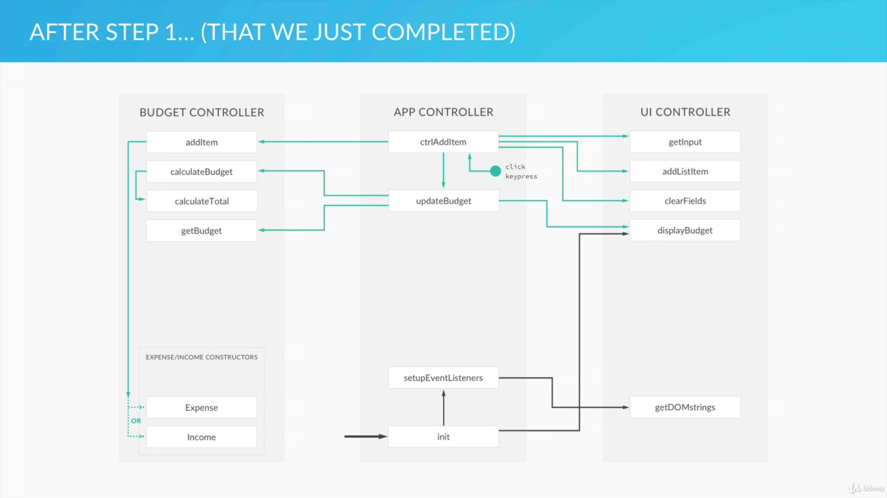
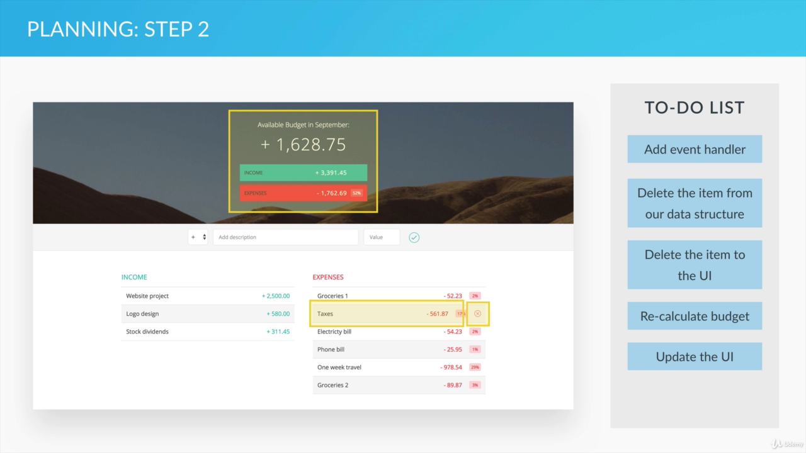
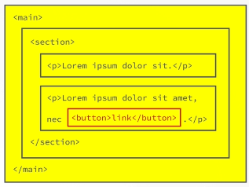
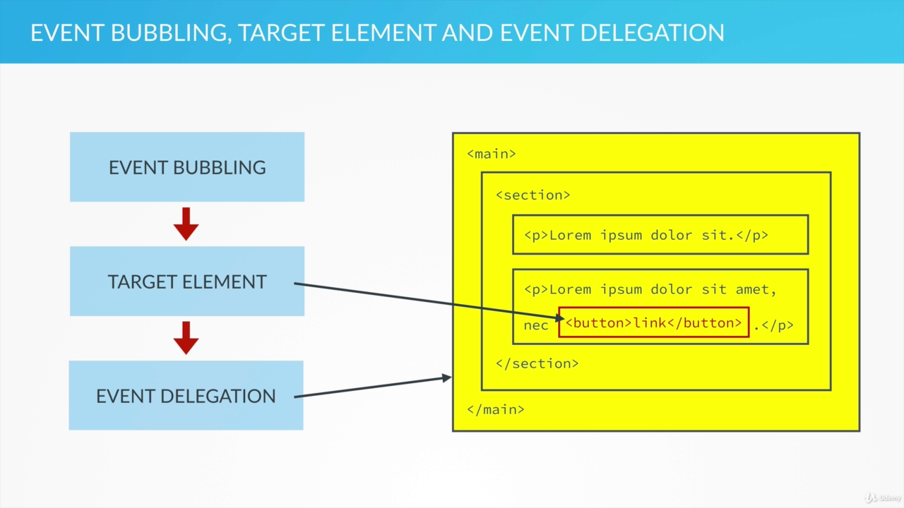
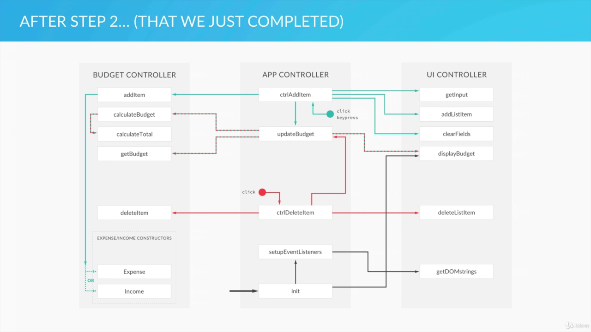

# Part 2

- Note about the Part 2 of the App begins here

## Project Planning and Architecture (Step-2)

### The structure of our app:



- There are 3 modules and their methods are represented above in the diagram.
- The green arrows show the connection between functions
- Green dot represents an event

### Planning (Step 2)

- Add functionality of deleting items.
- Here is the diagram for the to-do list:



## Event Delegation

### Event Bubbling:

- When an event is fired or triggered on some DOM element, like clicking on button then the exact same event is also triggered in all of the parent elements.



- Here event is triggred in button then it bubbles up and gets triggered for paragraph then for section then for main
- Event bubbles up inside the DOM tree.

#### Target Element:

- the element that triggered the event (button in above pic)
- Target element is stored as an property in event object
- So, parent elements will also know in which element the event was first fired.

If the event bubbles up in the DOM tree and if we know where the event was fired then we can simply attach an event handler to the parent element and wait for the event to bubble up. Then we can do whatever we want with the target element. This technique is called event delegation. We could simply add the event handler to the `<main></main>` element.



Event Delegation is not adding event handler to the target element but to the parent element that wait for the event to be bubbled up and then be triggered. Then we can act on the element that we are interested in using the target element property.

### Use Cases for Event delegation:

- When we have an element with lots of child elements that we are interested in
- When we want an event handler attached to an element that is not yet in the DOM when our page is loaded.

## Setting Up The Delete Event Listener Using Event Delegation:

- The code to delete income / expense items from the app.

### Content:

- How to use event delegation in practice using the concept of event bubbling and target element
- How to use IDs in HTML to connect the UI with the data model
- How to use the parentNode property for DOM traversing

### Setting Event Handler in the Parent Element:

A peek throught the HTML:

```html
<div class="container clearfix">
  <div class="income">
    <h2 class="icome__title">Income</h2>

    <div class="income__list">
      <!-- Income list and the delete button(class="item__delete--btn") are present here  -->
    </div>
  </div>

  <div class="expenses">
    <h2 class="expenses__title">Expenses</h2>
    <div class="expenses__list">
      <!-- Expense list and the delete button(class="item__delete--btn") are present here  -->
    </div>
  </div>
</div>
```

- We are going to listen to the button click event from the `container` element.
- We can add a single event handler for delete task when we use the `container` element.

```js
// Global APP Controller
var controller = (function (budgetCtrl, UICtrl) {
  var setupEventListeners = function () {
    // Function that sets up our event listeners
    var DOM = UICtrl.getDOMstrings();

  ..........................................

    document
      .querySelector(DOM.container)
      .addEventListener("click", ctrlDeleteItem);
  };
..................
}

// UI Controller
var UIController = (function () {
  var DOMstrings = {
.....................................
    container: ".container",
  };
.....................................
}
```

### The callback function for delete item:

```js
// Delete Item Callback Function
var ctrlDeleteItem = function (event) {
  // From event we can access the target element
  console.log(event.target);
};
```

- When we press the delete icon we must remove the content from the UI. Let's look at the HTML that defines the content:

```html
<div class="item clearfix" id="income-0">
  <div class="item__description">Salary</div>
  <div class="right clearfix">
    <div class="item__value">+ 2,100.00</div>
    <div class="item__delete">
      <button class="item__delete--btn">
        <i class="ion-ios-close-outline"></i>
      </button>
    </div>
  </div>
</div>
```

- Here we want to remove the `<div class="item clearfix" id="income-0">` part that hold the content, when the button (`<i class="ion-ios-close-outline"></i>`) is pressed.

### DOM Traversing:

- We are going to traverse from `<i>` to its parent

```js
// Delete Item Callback Function
var ctrlDeleteItem = function (event) {
  // From event we can access the target element
  console.log(event.target.parentNode);
};
```

- accessing `parentNode` logs button element; therefore, we traverse one step up to the parent element.
- But we want to traverse 4 element up to the `income-0` ish ids
- which we can do like this:
- `console.log(event.target.parentNode.parentNode.parentNode.parentNode);`
- the result is:

```html
<div class="item clearfix" id="income-0">
  <div class="item__description">Salary</div>
  <div class="right clearfix">
    <div class="item__value">+ 2,100.00</div>
    <div class="item__delete">
      <button class="item__delete--btn">
        <i class="ion-ios-close-outline"></i>
      </button>
    </div>
  </div>
</div>
```

- But all we need is an id as it is an unique identifier that can remove this component. SO we could write:

```js
console.log(event.target.parentNode.parentNode.parentNode.parentNode.id);
// Output when adding items:
// income-0
// income-1
// expense-o
..............
```

### Differentiating the types:

- we can read the inc-1 or exp-30 from the DOM but we'll have to recognize them as income or expense.
- They are a string and we can use `split()` method of a string.
- But string is a primitive as still it has a method.
- This is due to the fact that JS, wraps the primitive into a wrapper and converts it into an object `String` with bunch of its own methods.
- Same thing can happen to `numbers`

#### Demo of `split()` in console

```js
var s = "inc-1";
undefined
splitID = s.split('-');
(2) ["inc", "1"]
0: "inc"
1: "1"
length:
2__proto__: Array(0)
```

- `split()` returns an array that is separated by `"-"`

```js
p = "inc-1-tpe-4";
("inc-1-tpe-4");
splitted = p.split("-");
(4)[("inc", "1", "tpe", "4")];
```

#### Algorithm to delete item:

1. Delete the item from the data structure

2. Delete the item from the UI

3. Update and show the new budget

### Summary:

- We first set a event listener to the container and we used event delegation.

```js
document.querySelector(DOM.container).addEventListener("click", ctrlDeleteItem);
```

- Then we defined the call back function where we read the event object and read the item type and id:

```js
// Delete Item Callback Function
var ctrlDeleteItem = function (event) {
  var itemID, splitID, type, ID;

  // From event we can access the target element
  itemID = event.target.parentNode.parentNode.parentNode.parentNode.id;

  if (itemId) {
    // inc-1
    splitID = itemID.split("-"); // split() returns array
    type = splitID[0];
    ID = splitID[1];
  ..........................................
  }
};
```

- We read the target element using `event.target` property
- We used parentNode to traverse up.
- We read the id of the element.
- We used the split() to split string into array separated by "-"
- Then finally we read type and id

## Deleting an Item from our Budget Controller:

- Lets now create a new method in budget controller so we can delete an item from Data Structure.

### Content:

- `map()` method to loop over an array
- How to remove elements from an array using the splice method.

### Selecting ID:

- ids and array index are not a same
- we are going to delete an array item and we have an id. But we must be careful to not consider array's index as an id.
- So, we first access the element and then find out all the set of id and store them in a variable.
- And we find the index of the id that is of our interest.

```js
deleteItem: function (type, id) {
  var ids = data.allItems[type].map(function (current) {
    return current.id;
  });

  index = ids.indexOf(id);

  if (index !== -1) {
    data.allItems[type].splice(index, 1);
  }
},
```

#### `map()` function:

ref: https://developer.mozilla.org/en-US/docs/Web/JavaScript/Reference/Global_Objects/Array/map

- Similar to forEach function
- The `map()` method **creates a new array** populated with the results of calling a provided function on every element in the calling array.

**syntax**

```js
var new_array = arr.map(function callback( currentValue[, index[, array]]) {
    // return element for new_array
}[, thisArg])
```

#### indexOf() method:

- returns the index of the element in the array

#### Delete if index exists:

- If index !== -1 then delete the item using the splice method
- **splice()** method takes in the index and then number of item from the index as an argument.

```js
if (index !== -1) {
  data.allItems[type].splice(index, 1);
}
```

- Here, the item at index is deleted and only 1 item is deleted, that is specified in the argument while calling the splice method.

### Calling the `deleteItem()`

- Call it from the ctrlDeleteItem() as the first step in our delete algorithm

```js
// Delete Item Callback Function
var ctrlDeleteItem = function (event) {
  var itemID, splitID, type, ID;

  // From event we can access the target element
  itemID = event.target.parentNode.parentNode.parentNode.parentNode.id;

  if (itemID) {
    // inc-1
    splitID = itemID.split("-"); // split returns array
    type = splitID[0];
    ID = parseInt(splitID[1]);

    // 1. Delete the item from the data structure
    budgetCtrl.deleteItem(type, ID);

    // 2. Delete the item from the UI

    // 3. Update and show the new budget
  }
};
```

## Deleting an Item From From the UI:

### Content:

- How to delete an element from the DOM.

### Deleting from UI:

```js
deleteListItem: function (selectorID) {
  var el = document.getElementById(selectorID);
  el.parentNode.removeChild(el);
},
```

- Pretty weird right? You get an element and then you have to specify the child as that very element in the removeChild.

- ref: https://blog.garstasio.com/you-dont-need-jquery/dom-manipulation/

#### Callback function update

```js
    // Delete Item Callback Function
    var ctrlDeleteItem = function (event) {
      var itemID, splitID, type, ID;

      // From event we can access the target element
      itemID = event.target.parentNode.parentNode.parentNode.parentNode.id;

      .........................................

      // 2. Delete the item from the UI
      UICtrl.deleteListItem(itemID);

      // 3. Update and show the new budget
      updateBudget();
    }
  };
```

## Project Planning and Architecture (Step-3):

- After step2 our architecture look as follows:



- `updateBudget()` function's significance can be seen here. As it is called during both the addion and deletion of an item.

### Planning: Step 3

- #### Individual Percentage of the expense

  - Calculate Percentages
  - Update Pecentages in UI

- #### Update Date/Time at time

  - Display the current month and year

- #### Number Formatting

- #### Improve input field UX

## Updating the Percentages Controller:

- We are going to start with Updating the income percentages

### Content:

- Reinforcing the concepts and techniques that we have learned so far.

### Bainstorming:

- When will these income percentages be updated?
- Each time we add/delete an item.
- These percentages are the percentages of the income that each expense represents
- When we add/delete income all of the expense percentages will be updated.
- Also when we add/delete new expense the percentage must be updated
- We should create a new function and call them fron `ctrlAddItem` and `ctrlDeleteItem`
- Similar to `updateBudget`

### Algorithm:

```js
// Updating the Percentages:
var updatePercentages = function () {
  // 1. Calculate percentages
  // 2. Read percentages from the budget controller
  // 3. Update the UI with new percentages
};
```

- This function is called from `ctrlAddItem()` and `ctrlDeleteItem()`

## Updating the Percentages Budget Controller:

- We'll deal with the method that do the calculation of the expense percentages

### Content:

- How to make our budget controller interact with the Expense prototype

### Calculating Budget in `budgetController` :

- Adding a prototype method an a property

```js
// BUDGET
var budgetController = (function () {
  //expense
  var Expense = function (id, description, value) {
...............................................
    this.percentage = -1;
  };

  // Prototype methods to calculate and get percentages
  Expense.prototype.calcPercentage = function (totalIncome) {
    if (totalIncome > 0) {
      this.percentage = Math.round((this.value / totalIncome) * 100);
    } else {
      this.percentage = -1;
    }
  };

  Expense.prototype.getPercentage = function () {
    return this.percentage;
  };
................................................
  // Public Methods to calculate and get percentage:
  calculatePercentages: function () {
    data.allItems.exp.forEach(function (curr) {
      curr.calcPercentage(data.totals.inc);
    });
  },

  getPercentages: function () {
    var allPerc = data.allItems.exp.map(function (current) {
      return current.getPercentage();
      // the returned value is assigned to allPerc array
    });
    return allPerc;
  },
....................................
}

```

### Updating the app controller:

- Update Percentage method is defined
- And the method is called from the callback function of add and delete button

```js
// Global APP Controller
var controller = (function (budgetCtrl, UICtrl) {
........................................

  // Updating the Percentages:
  var updatePercentages = function () {
    // 1. Calculate percentages
    budgetCtrl.calculatePercentages();

    // 2. Read percentages from the budget controller
    var percentages = budgetCtrl.getPercentages();

    // 3. Update the UI with new percentages
    console.log(percentages);
  };
  ........................................

  // Callback Function
  var ctrlAddItem = function () {
  ...........................................


      // 6. Calculate and update percentages
      updatePercentages();
    }
  };

  // Delete Item Callback Function
  var ctrlDeleteItem = function (event) {
  ............................................

      // 4. Calculate and update percentages
      updatePercentages();
    }
  };
.................................
});
```

## Updating the Percentages UI Controller:

- We are going to display the percentages in the UI

### Content:

- How to create own forEach function but for nodeLists instead of Arrays

### Updating the UIController:

- The percentages are inside `item__percentage` class of `expense`
- So we are selecting `item__percentage` class
- set the DOMString:

```js
var DOMstrings = {
................................
  expensesPercentageLabel: ".item__percentage",
};
```

#### Node Lists:

- Each html element is a node in DOM

```js
var fields = document.querySelectorAll(DOMstrings.expensesPercentageLabel);
// Returns a Node List
```

- We loop over the Node and update the percentage value
- `nodeList` doesn't have the forEach method.

### `displayPercentage(percentages)`

- We pass the percentages and add them to the UI

```js

// UI Controller
var UIController = (function () {
  var DOMstrings = {
    ....................................
    expensesPercentageLabel: ".item__percentage",
  };
  ...........................................
    displayPercentages: function (percentages) {
      var fields = document.querySelectorAll(
        DOMstrings.expensesPercentageLabel
      ); // Returns a Node List

      // Custom forEach function
      var nodeListForEach = function (list, callback) {
        for (var i = 0; i < list.length; i++) {
          callback(list[i], i);
        }
      };

      nodeListForEach(fields, function (current, index) {
        if (percentages[index] > 0) {
          current.textContent = percentages[index] + "%";
        } else {
          current.textContent = "---";
        }
      });
    },
```

- Call the `displayPercentages(percentages)` from `updatePercentages()` method

```js
// Updating the Percentages:
var updatePercentages = function () {
  // 1. Calculate percentages
  budgetCtrl.calculatePercentages();

  // 2. Read percentages from the budget controller
  var percentages = budgetCtrl.getPercentages();

  // 3. Update the UI with new percentages
  UICtrl.displayPercentages(percentages);
};
```

## Formatting Our Budget Numbers String Manipulation

- We'll take care of giveing the number a proper formatting.
- Better look and easier to read

### Content:

- How to use different strings methods to manipulate strings.

### Looks Ideas:

- Every Number has two decimal parts(even if they are integers)
- Numbers are equally aligned that way
- `+` sign before income and `-` sign before expense
- If the number is in thousands then there are commas between them.

### Implementation Idea:

- Create a method inside UIController and each time we display a number call that method and recieve a formatted number. Then output that number.

### Algorithm:

- Calculate the absolute part of the number first.

```js
num = Math.abs(num);
```

- putting two digits after decimal

```js
(12.346).toFixed(2);
// "12.35"
(2).toFixed(2);
// "2.00"
```

- `toFixed()` method returns a string

```js
// UI Controller Private method:

var formatNumber = function (num, type) {
  var numSplit, int, dec;
  /*
  + or - before number
  exactly 2 decimal points
  comma separating the thousands
  */
  num = Math.abs(num);

  // Rounds to 2 decimals or adds 00
  num = num.toFixed(2); // Methods of Number prototype

  // Comma Separation:
  // Using split to separate decimal
  numSplit = num.split(".");
  int = numSplit[0];
  dec = numSplit[1];
  if (int.length > 3) {
    int = int.substr(0, int.length - 3) + "," + int.substr(int.length - 3, 3);
    // input : 2310, o/p: 2,310
  }

  return (type === "exp" ? "-" : "+") + " " + int + dec;
};
```

- place item in UI COntroller:

```js
newHtml = newHtml.replace("%value%", formatNumber(obj.value, type));
```

- Format the budget in UIController:

```js
    displayBudget: function (obj) {
      obj.budget > 0 ? (type = "inc") : (type = "exp");
      document.querySelector(DOMstrings.budgetLabel).textContent = formatNumber(
        obj.budget,
        type
      );
      document.querySelector(DOMstrings.incomeLabel).textContent = formatNumber(
        obj.totalInc,
        "inc"
      );
      document.querySelector(
        DOMstrings.expensesLabel
      ).textContent = formatNumber(obj.totalExp, "exp");
```

## Displaying the Current Month and Year:

- Display them as soon as we start the app

### Content:

- How to get the current dat by using the Date object constructor

### Function:

```js
displayMonth: function () {
  var now, year, months, month;

  var now = new Date();
  // var christmas = new Date(2020, 13, 25);

  months = [
    "jan",
    "feb",
    "march",
    "april",
    "may",
    "june",
    "july",
    "august",
    "spet",
    "oct",
    "nov",
    "dec",
  ];

  year = now.getFullYear(); //YY
  month = now.getMonth(); // MM

  document.querySelector(DOMstrings.dateLabel).textContent =
    months[month] + " " + year;
},
```

- Call it from the `init()`
- Declare dateLable in UIController
- We have used the `now()` function and change the value in the DOM.

## Finishing Touches Improving the UX:

- Polishing the User Interface even more

### Content:

- How and when to use 'change' events

While entering income we want our input field to be blue and for expense we want it to be red. We change the `+` and `-` from the dropdown and accordingly the income and expenses were added.

### Change Event:

- We can use these events whenever we change the dropdown.

```js
changedType: function () {
  var fields = document.querySelectorAll(
    DOMstrings.inputType +
      "," +
      DOMstrings.inputDescription +
      "," +
      DOMstrings.inputValue
  );

  nodeListForEach(fields, function (curr) {
    curr.classList.toggle("red-focus");
  });

  document.querySelector(DOMstrings.inputButton).classList.toggle("red");
}
```
