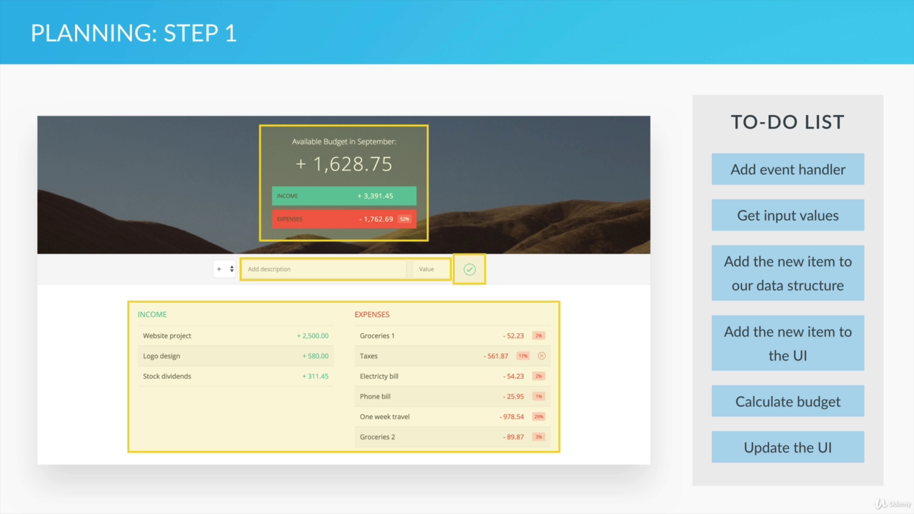
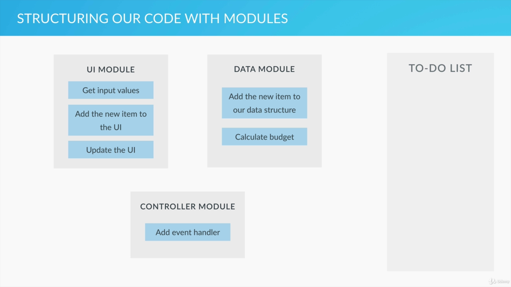
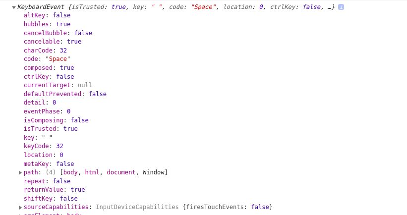
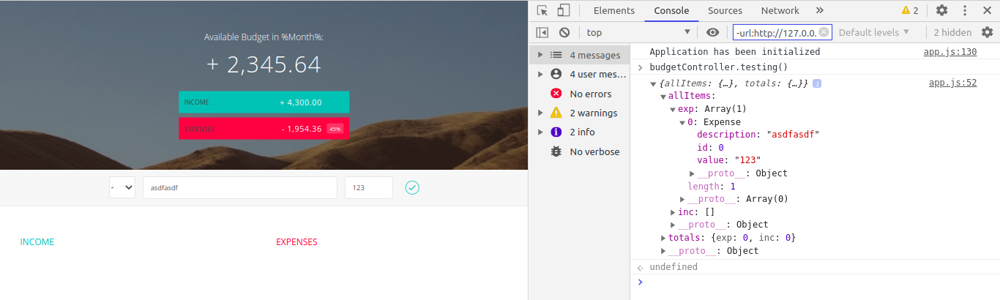

# 6. Putting It All Together The Budget App Project

- JS features (When to use them, how to structure them)

## Project Setup and Details:

### About Project:

- Add income (title and amount)
- Add expenses (title and amount)
- Display list of income and expenses
- Display balance
- Delete from list
- Display percentage for each item

## Project Planning and Architecture:

### Planning:



### Modules:

- For structuring our code.
- Cleanly separate code and organize them.
- Encapsulate some data into privacy and expose other data publicly.
- We can create code that are related to one another together inside a separate, independent, organized unit.



## Implementing the Module Pattern.

### Content:

- What is module patterns in JS
- How to use the module pattern
- More about private and public data, encapsulation and separate of concerns.

### Modules:

- It consists of variables that are private and accessible only within the module. We want that so that no other code can override our data. So, our data and code are going to be safe.
- Beside private variables and methods we are also going to have public methods, that can be used by other function and modules.
- This is called data encapsulation, which lets us hide the implementation details of a specific module from the outside scope so that we only expose a public interface which is sometimes called an API.

### Creating modules:

- Use the module pattern
- All we need to know are the concepts of closures and IIFEs.

#### A moodule that handles out budget data(budgetcontroller):

- We create a variable holding an object return by IIFEs (Immediately Invoked Function Expression) inside `app.js`
- IFFE gives data privacy because it creates a new scope that is not visible from the outside scope.

#### IIFE returning an object:

- An object that contains all the functions that we want to be public is returned
- Our Code for modules:

```js
var budgetController = (function () {
  var x = 23;
  var add = function (a) {
    return x + a;
  };

  return {
    publicTest: function (b) {
      console.log(add(b));
    },
  };
})();
```

- The output at the console:

```js
budgetController.x
  undefined
budgetController.publicTest()
  NaN
  undefined
budgetController.publicTest(2)
  25
  undefined
budgetController.add(2)
  VM274:1 Uncaught TypeError: budgetController.add is not a function
    at <anonymous>:1:18
```

- The intended demo: `add()` function and `x` is not accessible since it is not returned and the publicTest on the other hand is easily accessible. But the publicTest is able to access `add()` and `x`.
- When the JS runtime hit the line `var budgetController = (function () {`, an anonymous function is declared and immediately invoked.
- Then, variables and functions are declared and we returned an object with the method `publicTest()`.
- So the object that we returned is the one that gets assigned to the `budgetController`.
- `budgetController` is just a object containing `publicTest()` method.
- But the `publictest()` method can use the `x` variable and `add()` method even after the function is called. This is due to closure which allows inner function to access the outer function's property and method even after that outer function has been called.
- The x variable and add methods are in closure with inner publicTest method.

### UI Controller Module:

- We create these(UI and Budget) modules in the same file. But they are completely independent and bringing changes to one won't effect the other.

```js
var UIController = (function () {
  // Some Code
})();
```

### Connecting UI Controller and Budget Controller:

- So, that we can take data from UI and pass it to budgetcontroller
- We'll create the third module, called the `controller`

```js
var controller = (function () {
  //some code
})();
```

- Modules can also recieve an argument because they are simply a function expression.
- We are going to pass the other two modules as an argument to this controller so that this controller knows about the other two and can connect them.

```js
var controller = (function (budgetCtrl, UICtrl) {
  //some code
})(budgetController, UIController);
```

- Accessing publicTest() method:

```js
var controller = (function (budgetCtrl, UICtrl) {
  var z = budgetCtrl.publicTest(5);
  return {
    anotherPublic: function () {
      console.log(z);
    },
  };
})(budgetController, UIController);
// budgetController is in the outer scope and that could be used without passing // as an argument, but we want to make this module more independent
```

## Setting Up the first Event Listeners:

### Content:

- How to set up event listeners for keypress events.
- How to use event objects

#### Dummy Event Listener:

```js
// Global APP Controller
var controller = (function (budgetCtrl, UICtrl) {
  // Eventlistener for the input button, Decide what happens on each event and
  // delegate the task to other controllers

  // querySelector Uses same syntax as CSS selector
  document.querySelector(".add__btn").addEventListener("click", function () {
    console.log("Button was clicked");
  });
})(budgetController, UIController);
```

### Actual Task when the Button/Enter is pressed:

1. Get the field Input Data
2. Add the item to the budget Controller
3. Add the item to the UI
4. Calculate the budget
5. Display the budget

### Return Key presses the button:

- We are going to use the keypress event
- We are not going to select anything, but we will add this event listener to **global document**.
- event reference: https://developer.mozilla.org/en-US/docs/Web/Events
- We are going to use the `keypress` events. Which works when ANY key (except Shift, Fn, or CapsLock) is in pressed position. (Fired continously.)

```js
document.addEventListener("keypress", function (event) {
  // some code
  console.log(event);
});
```

- The browser automatically sends the event object to the anonymous function of the eventListener. We we are accepting the event object and logging it to the console. Here is what we have in the console:



- Important thing to note here is the keycode, since we pressed a space the keycode is **32**. This can be used to identify the key that was pressed
- Similarly for enter it is 13
- Keycode ref: http://keycodes.atjayjo.com/#charcode
- Some older browsers use the which property instead of the keycode property.
- So here's the eventListener for pressing enter key:

```js
document.addEventListener("keypress", function (event) {
  if (event.keyCode === 13 || event.which === 13) {
    console.log("Enter Was Pressed");
  }
});
```

### Common function for Button press and Enter press:

```js
// Global APP Controller
var controller = (function (budgetCtrl, UICtrl) {
  var ctrlAddItem = function () {
    // 1. Get the field Input Data
    // 2. Add the item to the budget Controller
    // 3. Add the item to the UI
    // 4. Calculate the budget
    // 5. Display the budget on the UI
  };

  document.querySelector(".add__btn").addEventListener("click", ctrlAddItem);

  document.addEventListener("keypress", function (event) {
    if (event.keyCode === 13 || event.which === 13) {
      ctrlAddItem();
    }
  });
})(budgetController, UIController);
```

- Instead of anonymous function we passed the ctrlAddItem in `add\_\_btn` querySelector
- And the same function is called from the keypress event listener's anonymous function

## Reading Input Data:

- We're going to read the income/user expense data from the UI

### Content:

- How to read data from different HTML input types.

### Logic:

- Controller is the place where we tell the other modules what to do.
- We write methods in the UI controller and in the budget controller to get some data for us or to calculate something and in the controller we call these methods.
- To get input From UI we are going to write method in the **UIController** and then call it from the **controller** and use the data further such as passing it to other controller and adding to the data structure.

### Methods in UIController:

- We are defining a method that returns an object of the input entry in UI
- This is catched by the controller when input is submitted by clicking a button or pressing enter.

```js
var UIController = (function () {
  return {
    // Method for returnig all of the inputs from UI
    getinput: function () {
      return {
        type: document.querySelector(".add__type").value,
        // + for inc, - for ex

        description: document.querySelector(".add__description").value,
        value: document.querySelector(".add__value").value,
      };
    },
  };
})();
```

- Method to catch an input in the app controller:

```js
// Global APP Controller
var controller = (function (budgetCtrl, UICtrl) {
  var ctrlAddItem = function () {
    // 1. Get the field Input Data
    var input = UICtrl.getinput();
    console.log(input);
  };

  document.querySelector(".add__btn").addEventListener("click", ctrlAddItem);

  document.addEventListener("keypress", function (event) {
    if (event.keyCode === 13 || event.which === 13) {
      ctrlAddItem();
    }
  });
})(budgetController, UIController);
```

- Now we have each of the modules talking to one another by calling each other's methods.

### Passing String Literal as querySelector is a bad idea:

- As we proceed with our app there is going to be tons of these selectors `'.btn'` sort of thing
- Changes in UI and class name would lead to tediousness in updating our files.
- We can easily create an object where we store all of these data
- Since it's about UI we'll create in the **UIController**.

```js
// UI Controller
var UIController = (function () {
  var DOMstrings = {
    inputType: ".add__type",
    inputDescription: ".add__description",
    inputValue: ".add__value",
  };

  return {
    // Method for returnig all of the inputs from UI
    getinput: function () {
      return {
        type: document.querySelector(DOMstrings.inputType).value,
        // + for inc, - for ex

        description: document.querySelector(DOMstrings.inputDescription).value,
        value: document.querySelector(DOMstrings.inputValue).value,
      };
    },
  };
})();
```

- Passing DOMString:

```js
//controller

// Global APP Controller
var controller = (function (budgetCtrl, UICtrl) {
  var DOM = UICtrl.getDOMstrings();
  ...

// UIController
var UIController = (function () {
  // Define DOMStrings
  var DOMstrings = {
    inputType: ".add__type",
    inputDescription: ".add__description",
    inputValue: ".add__value",
    inputButton: ".add__btn",
  };

  return {
    ...
    // method to return DOM strings
    getDOMstrings: function () {
      return DOMstrings;
    },
  };
```

## Creating an Initialization Function

- Similar to the one we did in pig game.

### Content:

- How and why to create an initialization function

### Organizing:

- Just keep the functions in the controller

```js
// Global APP Controller
var controller = (function (budgetCtrl, UICtrl) {
  var setupEventListeners = function () {
    // Function that sets up our event listeners
    var DOM = UICtrl.getDOMstrings();

    document
      .querySelector(DOM.inputButton)
      .addEventListener("click", ctrlAddItem);

    document.addEventListener("keypress", function (event) {
      if (event.keyCode === 13 || event.which === 13) {
        ctrlAddItem();
      }
    });
  };
  var ctrlAddItem = function () {
    var input = UICtrl.getinput();
  };

  return {
    // Initialization function
    init: function () {
      console.log("Application has been initialized");
      setupEventListeners();
    },
  };
})(budgetController, UIController);
```

- We set up the event listeners and DOM variables inside a setup function. Now we need to call that function using the `init()` function which is a public function.
- So our initialization function is the only way to setup the event listeners.

## Creating Income and Expense Function Constructors:

- How we are going to store our income and expense data in the budget controller.

### Content:

- How to choose function constructors that meet our application's needs
- How to set up a proper data structure for our budget controller.

### budgetController data model

- We need a data model for expenses and income
- We know that each new item will have description and a value.
- We must also distinguish between different income and expenses. So we need a unique ID number as well.
- We are going to choose an object that has description, value, and an ID.
- When we have to create lots of objects we are obviously going to create a function constructors which we can use to instantiate lots of expense and income objects.

### Function constructors for data:

- Expense will have additional field in the future so we have created two different constructor for expense and income.

```js
var budgetController = (function () {
  //expense
  var Expense = function (id, description, value) {
    this.id = id;
    this.description = description;
    this.value = value;
  };
  var Income = function (id, description, value) {
    this.id = id;
    this.description = description;
    this.value = value;
  };
})();
```

### Data Structure of Budget Controller:

- Budget controller keeps track of all income and expenses, the budget itself and later also of the percentage.
- Where would we store all the incomes and expenses. Best solution would be using an array.

#### Code:

```js
var data = {
  allItems: {
    exp: [],
    inc: [],
  },
  totals: {
    exp: 0,
    inc: 0,
  },
};
```

- array of income and expenses contains all the incomes and expenses which is contained by allItems object which is then contained by data object. The idea is to keep data within a single object as much as possible instead of having a lot of random variables floating around.

## Adding a New Item To Our Budget Controller:

- Use the user input data to create a new item in budget controller data stucture

### Content:

- How to avoid conflicts in our data structures
- How and why to pass data from one module to another

### Adding a new item into our data structure:

- Return an object with all the public methods of budget controller:
- We'll check the type argument and create the object accordingly

```js
  ...............................

  return {
    addItem: function (type, des, val) {
      var newItem;

      // Create new ID
      if (data.allItems[type].length > 0) {
        // Increment ID by adding to the last element's ID
        // (a default property of array.)
        // last elements avoids the duplication
        ID = data.allItems[type][data.allItems[type].length - 1].id + 1;
      } else {
        ID = 0;
      }

      // Create new item based on 'inc' or 'exp' type
      if (type === "exp") {
        newItem = new Expense(ID, des, val);
      } else if (type === "inc") {
        newItem = new Income(ID, des, val);
      }

      // Push it into our data structure
      data.allItems[type].push(newItem);

      // Return the new element
      return newItem;
    },

    testing: function () {
      console.log(data);
    },
  };
})();
```

- We will call the `addItem()` from the main `controller`

```js
// Global APP Controller
var controller = (function (budgetCtrl, UICtrl) {
  ....................
  var ctrlAddItem = function () {
    // Declare Variables
    var input, newItem;

    // 1. Get the field Input Data
    input = UICtrl.getinput();

    // 2. Add the item to the budget Controller
    newItem = budgetCtrl.addItem(input.type, input.description, input.value);
  };
  ..................
})(budgetController, UIController);
```

- Controller reads the input using UIController's `getInput()` and saves them to object using budgetController's `addItem()`
- `addItem()` closes in the budgetController's data

### How data are stored:



- I added a expense data by description asdfasd and value 123 and id is initialized to 0. This data is accessible from the testing function of budgetController
- We can also see the addition in expense array while income array and total arrays are empty since we haven't added the value for them.

## Adding a New Item to the UI

- The object that we create is going to be added to the UI in this section.
- There is going to be DOM Manipulations

### Contents:

- A technique for adding big chunks of HTML into the DOM
- How to replace parts of strings
- How to do DOM manipulation using the inserAdjacentHTML method.

### UIController gets a new public method:

- This function will create HTML string with placeholder text
- Replace the placeholder text with some actual data
- Insert the html into the dom

```js
    addListItem: function (obj, type) {
      // Create HTML string with placeholder text
      // Replace the placeholder text with some actual data
      // Insert the html into the dom
    },
```

### Calling from the controller:

- from the callback function

```js
// Callback Function
var ctrlAddItem = function () {
  // call here
};
```

### HTML place holder example:

- For income:

```html
<div class="item clearfix" id="income-0">
  <div class="item__description">Salary</div>
  <div class="right clearfix">
    <div class="item__value">+ 2,100.00</div>
    <div class="item__delete">
      <button class="item__delete--btn">
        <i class="ion-ios-close-outline"></i>
      </button>
    </div>
  </div>
</div>
```

- For expense:

```html
<div class="item clearfix" id="expense-0">
  <div class="item__description">Apartment rent</div>
  <div class="right clearfix">
    <div class="item__value">- 900.00</div>
    <div class="item__percentage">21%</div>
    <div class="item__delete">
      <button class="item__delete--btn">
        <i class="ion-ios-close-outline"></i>
      </button>
    </div>
  </div>
</div>
```

- The Percentage is added in expense and the id of course is different

### Using single quote:

- so that start of string and end is by single quote
- Any double quote is not regarded as end of string rather a part of string

```js
// Create HTML string with placeholder text
if (type === "inc") {
  html =
    '<div class="item clearfix" id="income-%id%"><div class = "item__description" >%description%</div><div class="right clearfix"><div class="item__value">%value%</div>  <div class="item__delete"><button class="item__delete--btn"><i class="ion-ios-close-outline"></i></button></div></div></div>';
} else if (type === "exp") {
  html =
    '<div class="item clearfix" id="expense-%id%"> <div class="item__description">%description%</div> <div class="right clearfix"> <div class="item__value">%value%</div> <div class="item__percentage">21%</div> <div class="item__delete"> <button class="item__delete--btn"><i class="ion-ios-close-outline"></i></button> </div> </div> </div>';
}
```

- Here we have used %id%, %value% and %description% as a placeholder so it can be easily replaced

### Replacing the placeholder:

- We are using the inbuilt replace function:

```js
// Replace the placeholder text with some actual data
newHtml = html.replace("%id%", obj.id);
newHtml = newhtml.replace("%value%", obj.value);
newHtml = newhtml.replace("%description%", obj.description);
```

### Insert the HTML into the DOM:

- First select an element from our web page.
- Then insert html next to that element
- We are going to use the `insertAdjectHTML()` method for this task.

#### Syntax

`element.insertAdjacentHTML(position, text);`

- ref: https://developer.mozilla.org/en-US/docs/Web/API/Element/insertAdjacentHTML

**position**

- A DOMString representing the position relative to the element; must be one of the following strings:
- `'beforebegin'`: Before the element itself.
- `'afterbegin'`: Just inside the element, before its first child.
- `'beforeend'`: Just inside the element, after its last child.
- `'afterend'`: After the element itself.

**text**

- The string to be parsed as HTML or XML and inserted into the tree.

**visualization for `<p></p>` element**:

```html
<!-- beforebegin -->
<p>
  <!-- afterbegin -->
  foo
  <!-- beforeend -->
</p>
<!-- afterend -->
```

#### Code:

- We are going to use the `beforeend` because we are going to insert inside a container as its child and beforeend allows us to put it right after the container's opening div

```js
// UI Controller
var UIController = (function () {
  var DOMstrings = {
    ..................................
    incomeContainer: ".income__list",
    expensesContainer: ".expenses__list",
  };

  return {
    .................

    addListItem: function (obj, type) {
      var html, element;

      // Create HTML string with placeholder text
      if (type === "inc") {
        element = DOMstrings.incomeContainer;
        html =
          '<div ...';
      } else if (type === "exp") {
        element = DOMstrings.expensesContainer;
        html =
          '<div...';
      }

      // Replace the placeholder text with some actual data
      newHtml = html.replace("%id%", obj.id);
      newHtml = newHtml.replace("%value%", obj.value);
      newHtml = newHtml.replace("%description%", obj.description);

      // Insert the html into the dom
      document
        .querySelector(element)
        .insertAdjacentHTML("beforeend", newHtml);
    },

  };
})();
```

- The html divs:

```html
.............
<div class="income__list">
  <!-- Inserted here -->
</div>
.................
<div class="expenses__list">
  <!-- Inserted here -->
</div>
...................
```

## Clearing Our Input Fields:

- We must clear the input field after we enter the input

### Content:

- How to clear HTML fields
- How to use querySelectorAll
- How to convert a list to an array
- A better way to loop over an array than for loops: foreach.

### querySelector():

- The Document method `querySelectorAll()` returns a static (not live) `NodeList` representing a list of the document's elements that match the specified group of selectors.
- Example:

```js
fields = document.querySelectorAll(
  DOMstrings.inputDescription + "," + DOMstrings.inputValue
);
```

### Lists in JS:

- List is similar to array but doesn't have methods of an array
- `fields` is a list

#### Converting list to array:

- use array's method called slice, which return a copy of the array.
- Usually slice is called on array and it returns another array. But we can use a trick to work on list.
- We can use the call method to trick `slice()` into treating list like an array.

```js
fieldsArr = Array.prototype.slice.call(fields);
```

### Looping over array to remove the content from their field:

- We'll use the `foreach()` method
- The `forEach()` method executes a provided function once for each array element.

```js
fieldsArr.forEach(function (current, index, array) {
  current.value = "";
});
```

#### Callback of foreach:

`forEach()` calls a provided `callback` function once for each element in an array in ascending order. `callback` is invoked with three arguments:

- the value of the element
- the index of the element
- the Array object being traversed

### Update the Enter Item callback:

```js
var ctrlAddItem = function () {
  // Declare Variables
  // 1. Get the field Input Data
  // 2. Add the item to the budget Controller
  // 3. Add the item to the UI

  // 4. Clear the fields
  UICtrl.clearFields();

  // 5. Calculate the budget
  // 6. Display the budget on the UI
};
```

### Final Clear Field:

- We have also changed the focus to description on addition of new item

```js
clearFields: function () {
  var fields, fieldsArr;
  fields = document.querySelectorAll(
    DOMstrings.inputDescription + "," + DOMstrings.inputValue
  );

  fieldsArr = Array.prototype.slice.call(fields);

  fieldsArr.forEach(function (current, index, array) {
    current.value = "";
  });

  // to change focus to description field after adding item
  fieldsArr[0].focus();
}
```
