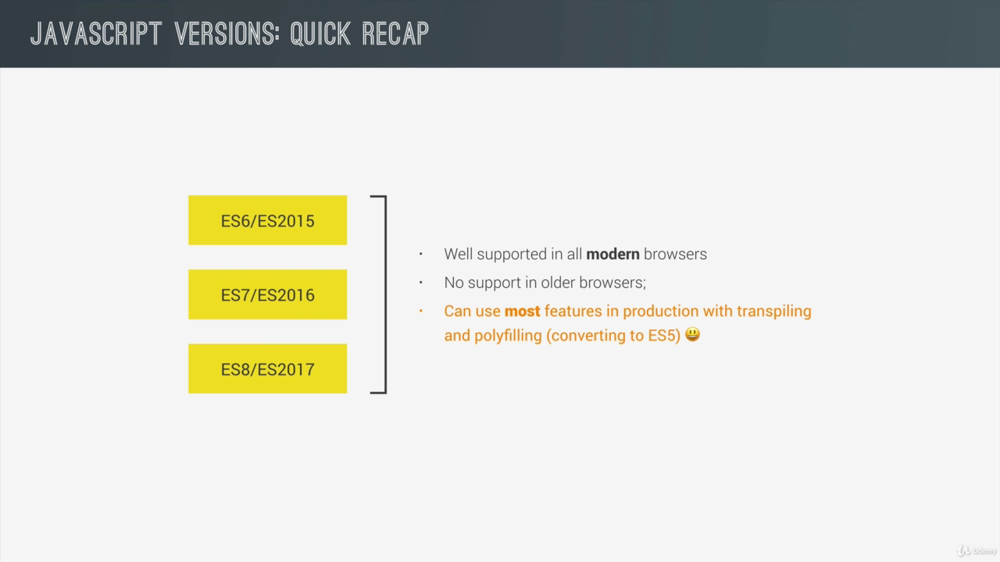
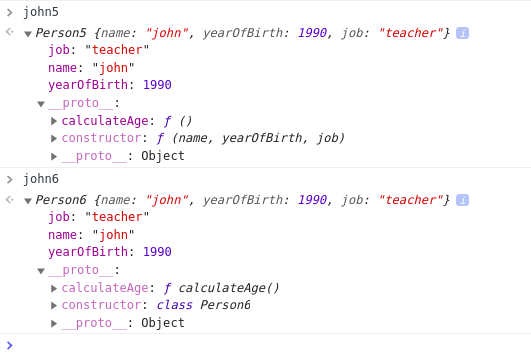
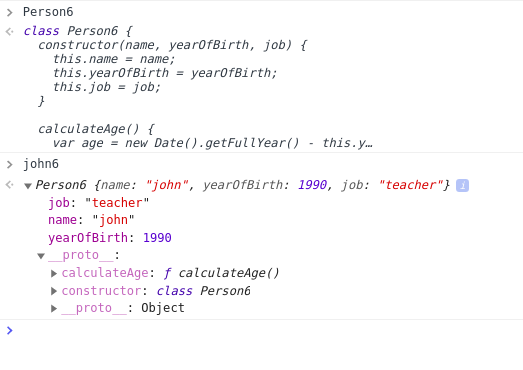

# Next Generation JavaScript Intro to ES6 ES2015

- We'll move from ES5 to ES6 + now
- Few syntax may have changed and few feature have been added but how the language works is the same

## What's new in ES6 ES2015:

- Major changes was introduced in ES6 and this section is devoted to ES6.
- Although other version ES7-8 will also be discussed



## Content:

- Variable Declarations with `let` and `const`
- Blocks and IIFEs
- Strings
- Arrow Functions
- Destucturing
- Arrays (method)
- The Spread Operator
- Rest and Default Parameters
- Maps
- Classes and Subclasses

### Later Content:

- Promises (Async Stuff)
- Native Modules (To separate codes)

## Variable Declarations with `let` and `const`:

- Let : similar to var
- Const: For constant

```js
// ES6
const name6 = "Jane Smith";
let age6 = 23;
name6 = "Jane Miller";
console.log(name6);

// Uncaught TypeError: Assignment to constant variable.
```

- Variable declared with `var` is **function** scoped but the variable declared with `let` and `const` are **block**(if elwse, for, while, switch, function, ... ) scoped.

### Demo:

```js
// ES5
function driverLicence(passedTest) {
  if (passedTest) {
    var firstName = "John";
    var yearOfBirth = 1990;
  }
  console.log(
    firstName +
      ", born in " +
      yearOfBirth +
      " is now officially allowd to deive a car"
  );
}

driverLicence(true);
// John, born in 1990 is now officially allowd to deive a car

// ES6
function driverLicence6(passedTest) {
  if (passedTest) {
    let firstName = "John";
    const yearOfBirth = 1990;
  }
  console.log(
    firstName +
      ", born in " +
      yearOfBirth +
      " is now officially allowd to deive a car"
  );
}

driverLicence6(true);
// Uncaught ReferenceError: firstName is not defined
    at driverLicence6
```

### Block:

- has a scope
- `let` and `const` has a scope within these blocks

### Solving the code:

```js
// ES6
function driverLicence6(passedTest) {
  let firstName = "John";
  const yearOfBirth = 1990;
  if (passedTest) {
    console.log(
      firstName +
        ", born in " +
        yearOfBirth +
        " is now officially allowd to deive a car"
    );
  }
}

driverLicence6(true);
//John, born in 1990 is now officially allowd to deive a car
```

### Declaring and Defining Constant :

- Uncaught SyntaxError: Missing initializer in const declaration

```js

// ES6
function driverLicence6(passedTest) {
  let firstName ;
  const yearOfBirth;
  // Replace with const yearOfBirth = 1990;
  if (passedTest) {
    firstName = "John";
    yearOfBirth = 1990;
    //Uncaught SyntaxError: Missing initializer in const declaration
    console.log(
      firstName +
        ", born in " +
        yearOfBirth +
        " is now officially allowd to deive a car"
    );
  }
}

driverLicence6(true);
```

### Hoisting the `let` variables:

- We have log the `firstName` variable before assigning the value.
- But it is logged as undefined that is because variables are hoisted before the line of execution where the variable is declared is reached but they are assigned only when the line of assignment is reached in the program excution.

```js
// ES6
function driverLicence6(passedTest) {
  let firstName;
  const yearOfBirth = 1990;
  if (passedTest) {
    console.log(firstName); // undefined
    firstName = "John";

    //Uncaught SyntaxError: Missing initializer in const declaration
    console.log(
      firstName +
        ", born in " +
        yearOfBirth +
        " is now officially allowd to deive a car"
    );
  }
}

driverLicence6(true);
// undefned
// John, born in 1990 is now officially allowd to deive a car
```

- Although we can use them and see their value is undefined before the value assignment, we cannot use the variable before declaration with `let` and `const`

```js
function driverLicence6(passedTest) {
  console.log(firstName); // error
  let firstName;
}
driverLicence6(true);
// Uncaught ReferenceError: Cannot access 'firstName' before initialization
```

### Temporal dead Zone:

- Although variables are hoisted we still cannot accessed them before they are declared.
- We can only use a variable after we declared and define them.

### The i conundrum: (Self Mafde name):

- i outside for and inside for are two completely different VARIABLES.

```js
let i = 23;
for (let i = 0; i < 5; i++) {
  console.log(i);
}

console.log(i);
```

- O/P:

```console
    0
    1
    2
    3
    4
    23
```

```js
driverLicence6(true);

let j = 23;
for (let i = 0; i < 5; i++) {
  console.log(j * i);
}

console.log(j);

/*
 0
 23
 46
 69
 92
 23
 */
```

- Using `var` on similar setting:

```js
var i = 23;
for (var i = 0; i < 5; i++) {
  console.log(i);
}

console.log(i);

//  0
//  1
//  2
//  3
//  4
//  5
```

- `i` is not block scoped with var

## Blocks and IIFEs:

- New way of creating IIFEs will be discussed
- Block scope gives us a data privacy, for which we relied on IIFEs before

### A New Way to Create Block in ES6:

```js
{
  const a = 1;
  let b = 2;
}

console.log(a + b);
// Uncaught ReferenceError: a is not defined
```

- Somewhat like IIFEs

### With var though :

```js
{
  var c = 3;
}

console.log(c); // 3
```

## Strings in ES6:

### Template Literals:

- Use the **\$ { }** for variables and expression inside **\` \`**, which is the backtick

```js
let firstName = "john";
let lastName = "Smith";

const yearOfBirth = 1990;

function calcAge(year) {
  return 2020 - year;
}

// ES5
console.log(
  "This is " +
    firstName +
    " " +
    lastName +
    ". He was born in " +
    yearOfBirth +
    ". Today, he is  " +
    calcAge(yearOfBirth)
);

// ES6:
console.log(
  `This is ${firstName} ${lastName}. He was born in ${yearOfBirth}. Today, he is ${calcAge(
    yearOfBirth
  )} years old.`
);
// This is john Smith. He was born in 1990. Today, he is 30 years old.
```

### New Methods:

```js
const n = `${firstName} ${lastName}`;
console.log(n.startsWith("J")); //true ( because n = John Smith starts with J)
console.log(n.endsWith("h")); //true
console.log(n.includes(" ")); //true (Ther is a space in string)
console.log(firstName.repeat(5)); // JohnJohnJohnJohnJohn
console.log(`${firstName} `.repeat(5)); // John John John John John
```

## Arrow Functions:

An arrow function expression is a syntactically compact alternative to a regular function expression, although without its own bindings to the `this`, arguments, super, or new.target keywords. Arrow function expressions are ill suited as methods, and they cannot be used as constructors.

```js
const years = [1990, 1965, 1982, 1937];

// ES5
var ages5 = years.map(function (el) {
  return 2020 - el;
});

console.log(ages5);
/*
Array(4)
0: 30
1: 55
2: 38
3: 83
length: 4
__proto__: Array(0)
*/
```

#### Syntax:

```js
(param1, param2, …, paramN) => { statements }
(param1, param2, …, paramN) => expression
// equivalent to: => { return expression; }

// Parentheses are optional when there's only one parameter name:
(singleParam) => { statements }
singleParam => { statements }

// The parameter list for a function with no parameters should be written with a pair of parentheses.
() => { statements }
```

### Arrow functions variations:

- **One argument**, **a line of code** (parenthesis not needed surroundning an argument)
- `const ages6 = years.map((el) => 2020 - el);` here, el is the argument and `2020 - el` is the **return** expression.

```js
//ES6:
const ages6 = years.map((el) => 2020 - el);
console.log(ages6);
/*
Array(4)
0: 30
1: 55
2: 38
3: 83
length: 4
__proto__: Array(0)
*/
```

- **Two arguments** (or more) in an parenthesis

```js
let ages6 = years.map((el, index) => `Age element ${index + 1}: ${2020 - el}`);
console.log(ages6);
/*
(4) ["Age element 1: 30", "Age element 2: 55", "Age element 3: 38", "Age element 4: 83"]
0: "Age element 1: 30"
1: "Age element 2: 55"
2: "Age element 3: 38"
3: "Age element 4: 83"
length: 4
__proto__: Array(0)
*/
```

- More lines of code and a return statement with return keyword and curly braces

```js
ages6 = years.map((el, index) => {
  const now = new Date().getFullYear();
  const age = now - el;
  return `Age element ${index + 1}: ${age}`;
});

console.log(ages6);
/*
(4) ["Age element 1: 30", "Age element 2: 55", "Age element 3: 38", "Age element 4: 83"]
0: "Age element 1: 30"
1: "Age element 2: 55"
2: "Age element 3: 38"
3: "Age element 4: 83"
length: 4
__proto__: Array(0)
*/
```

## Arrow Function Lexical 'this' Keyword:

- The biggest advantage of using the arrow function might be that they share the surrounding this keyword.
- Unlike normal functions, arrow functions don't get their this keyword.
- They simply use the `this` keyword of the function they are written in. So, we say they have a lexical this variable.

```js
//ES5
var box5 = {
  color: "green",
  position: 1,
  clickMe: function () {
    document.querySelector(".green").addEventListener("click", function () {
      var str =
        "This is box number " + this.position + " and it is " + this.color;
      alert(str);
    });
  },
};

box5.clickMe();
```

- here the `this.position` and `this.color` is read as undefined. This happens because only in a method call the `this` keyword actually points to the object.
- But in the regular function (or a callback function) call the `this` keyword will point to the global objects i.e the window object.
- Solution in ES5:

```js
//ES5
var box5 = {
  color: "green",
  position: 1,
  clickMe: function () {
    self = this;
    document.querySelector(".green").addEventListener("click", function () {
      var str =
        "This is box number " + self.position + " and it is " + self.color;
      alert(str);
    });
  },
};

box5.clickMe();
```

- We assign this variable to some other variable and later use that variable. `self` in our case.
- it is a workaround, or a hack.

### Arrow function and `this`:

- No hack required, the arrow function shares the lexical this keyword.
- Arrow function can access the this variable of its surrounding function.

```js
//ES6
const box6 = {
  color: "green",
  position: 1,
  clickMe: function () {
    document.querySelector(".green").addEventListener("click", () => {
      var str =
        "This is box number " + this.position + " and it is " + this.color;
      alert(str);
    });
  },
};

box6.clickMe();
```

- Arrow functions are useful when you have to preserve the value of `this` keyword.

### `clickMe()` as arrow function is not a good idea:

```js
//ES6
const box6 = {
  color: "green",
  position: 1,
  clickMe: () => {
    document.querySelector(".green").addEventListener("click", () => {
      var str =
        "This is box number " + this.position + " and it is " + this.color;
      alert(str);
    });
  },
};

box6.clickMe();
```

- here again we get the `undefined` for `this.position` and `this.color` since `clickMe()`'s surrounding is global object and its child arrow function will also have global object where `position` and `color` are `undefined`.

### Arrow function with constructor:

```js
function Person(name) {
  this.name = name;
}

// ES5
Person.prototype.myFriends5 = function (friends) {
  var arr = friends.map(function (el) {
    return this.name + " is friends with " + el;
  });
  console.log(arr);
};

var friends = ["Bob", "Jane", "Mark"];
new Person("John").myFriends5(friends);
/*
(3) [" is friends with Bob", " is friends with Jane", " is friends with Mark"]
0: " is friends with Bob"
1: " is friends with Jane"
2: " is friends with Mark"
length: 3
__proto__: Array(0)
*/
```

- The name is not defined
- The anonymous callback function is not going to have access to the `this` variable so the `name` is not displayed here too.
- We can use the **call**, **bind** and **apply** as they allow us to define the `this` variable manually.
- **bind** method creates a copy of the function.
- Making the following modification will make the function work

```js
..............
  var arr = friends.map(
    function (el) {
      return this.name + " is friends with " + el;
    }.bind(this)
  );
.....................
/*
(3) ["John is friends with Bob", "John is friends with Jane", "John is friends with Mark"]
0: "John is friends with Bob"
1: "John is friends with Jane"
2: "John is friends with Mark"
length: 3
__proto__: Array(0)
*/
```

- In ES6:

```js
// ES6

function Person(name) {
  this.name = name;
}

Person.prototype.myFriends6 = function (friends) {
  var arr = friends.map((el) => `${this.name} is friends with ${el}`);
  console.log(arr);
};

var friends = ["Bob", "Jane", "Mark"];
new Person("Mike").myFriends6(friends);

/*
(3) ["Mike is friends with Bob", "Mike is friends with Jane", "Mike is friends with Mark"]
0: "Mike is friends with Bob"
1: "Mike is friends with Jane"
2: "Mike is friends with Mark"
length: 3
__proto__: Array(0)
*/
```

## Destructuring:

- It is a very convenient way to extract data from data structure such as object or an array.

### Storing Array's item in a single variable:

- Here `name` and `age` constant variables are created and they are assigned the value of `"John"` and `26`

```js
//ES5
// var john = ["John", 26];
// var name = john[0];
// var age = john[1];

// ES6
const [name, age] = ["John", 26];
console.log(name); // John
console.log(age); // 26
```

- We destructured `["John", 26];` using the syntax : `const [name, age] =`
- It is like opposite of constructing a data structure

### Destructuring with Objects:

- Use curly braces surrounding the variable
- Use the variable name, same as the key in the object

```js
//With Objects
const obj = {
  firstName: "John",
  lastName: "Smith",
};

const { firstName, lastName } = obj;

console.log(firstName); // John
console.log(lastName); // Smith
```

### If we want to set a different variable name:

```js
const { firstName: a, lastName: b } = obj;
console.log(a); // john
console.log(b); // smith
```

### Use Cases:

#### Returning Multiple Values from a Function:

- In ES5 we used objects to return multiple values

```js
function calcAgeRetirement(year) {
  const age = new Date().getFullYear() - year;
  return [age, 65 - age];
}

const [age2, retirement] = calcAgeRetirement(1990);
console.log(age2); // 30
console.log(retirement); // 35
```

## Arrays in ES5 ES2015

- New Methods and New Kind of Loop
- `querySelectorAll` returns a NodeList not an Array. We transformed using `slice` and `call()` in ES5.

```js
const boxes = document.querySelectorAll(".box");

// ES5
var boxesArr5 = Array.prototype.slice.call(boxes);

boxesArr5.forEach(function (cur) {
  cur.style.backgroundColor = "dodgerblue";
});

//ES6
const boxesArr6 = Array.from(boxes);
// Transform nodeslist into array

boxesArr6.forEach((cur) => (cur.style.backgroundColor = "dodgerblue"));
```

- In ES6 we have the `from()` method which transforms `NodeLists` into `Arrays`

### Looping Over an Array:

- We usually use the `forEach` or `map` method and the problem with them is that we cannot `break` from them.
- We also cannot use the `continue` statement
- In ES5 we'd use the for loop.

### ES5 Version:

- Note that we can also use the property, `className` where we can set the HTML class

```js
// ES5
for (var i = 0; i < boxesArr5.length; i++) {
  if (boxesArr5[i].className === "box blue") {
    continue;
  }
  boxesArr5[i].textContent = "I Changed to blue";
}
```

### `for - of` loop:

#### Syntax

```js
for (variable of iterable) {
  statement;
}
```

**variable**
On each iteration a value of a different property is assigned to `variable`. `variable` may be declared with const, let, or var.

**iterable**
Object whose `iterable` properties are iterated.

```js
//ES6
for (const cur of boxesArr6) {
  if (cur.className === "box blue") {
    continue;
  }
  cur.textContent = "I Changed to blue";
}
```

- We can also use string's method `includes()` here

```js
if (cur.className.includes('blue'))
```

### finding index and finding items:

```js
//ES5
var ages = [12, 17, 8, 21, 14, 11];

var full = ages.map(function (cur) {
  return cur >= 18;
});
console.log(full);

console.log(full.indexOf(true)); //3 first index of true

console.log(ages[full.indexOf(true)]); // 21

// ES6:
console.log(ages.findIndex((cur) => cur >= 18)); //3
console.log(ages.find((cur) => cur >= 18)); //21
```

### `findIndex()`:

`Array.prototype.findIndex()`

The `findIndex()` method returns the index of the first element in the array that satisfies the provided testing function. Otherwise, it returns -1, indicating that no element passed the test.

#### Syntax

`arr.findIndex(callback( element[, index[, array]] )[, thisArg])`

**Parameters**

_callback_

A function to execute on each value in the array until the function returns true, indicating that the satisfying element was found.

It takes three arguments:

_element_

The current element being processed in the array.

_index Optional_

The index of the current element being processed in the array.

_array Optional_

The array findIndex() was called upon.

_thisArg Optional_

Optional object to use as this when executing callback.

**Return value**

The index of the first element in the array that passes the test. Otherwise, -1.

### `find()` method:

The `find()` method returns the value of the first element in the provided array that satisfies the provided testing function.

## The Spread Operator:

- A very convenient way to expand elements of an array in places like arguments and function calls.
- In ES5 we could use the apply method to pass the array's element as an individual argument.
- But in ES6 we could just use the spread operator to expand the array and send it as an argument

```js
function addFourAges(a, b, c, d) {
  return a + b + c + d;
}

var sum1 = addFourAges(10, 30, 12, 21);
console.log(sum1); //73

// Passing numbers from array:
var ages = [10, 30, 12, 21];
var sum2 = addFourAges.apply(null, ages);
console.log(sum2); //73

// ES6
const sum3 = addFourAges(...ages);
// console.log(sum3); // 73
```

### Use Cases of the spread Operator:

#### Joining Two Arrays:

```js
const familySmith = ["John", "Jane", "Mark"];
const familyMiller = ["Mary", "Bob", "Ann"];
const bigFamily = [...familySmith, "Lily", ...familyMiller];
console.log(bigFamily);
/*
(7) ["John", "Jane", "Mark", "Lily", "Mary", "Bob", "Ann"]
0: "John"
1: "Jane"
2: "Mark"
3: "Lily"
4: "Mary"
5: "Bob"
6: "Ann"
length: 7
__proto__: Array(0)
*/
```

#### Using in NodeList:

```js
const h = document.querySelector("h1");
const boxes = document.querySelectorAll(".box"); // NodeList
const all = [h, ...boxes];

Array.from(all).forEach((curr) => (curr.style.color = "purple"));
```

## Rest Parameters:

- We're going to talk about function parameters
- Rest Parameters allow us to pass an arbitrary number of arguments into a function and use these arguments in that function.
- Use the same notation as the spread operator but are in fact an exact opposite thing.
- While the spread operator transform arrays into single value, the rest parameter transforms collections of values into an array when we call the function with multilpe parameters.
- The rest parameter syntax allows us to represent an indefinite number of arguments as an array.

### Syntax

```js
function f(a, b, ...theArgs) {
  // ...
}
```

### Description

A function's last parameter can be prefixed with `...` which will cause all remaining (user supplied) arguments to be placed within a "standard" JavaScript array.

Only the last parameter can be a **"rest parameter"**.

```js
function myFun(a, b, ...manyMoreArgs) {
  console.log("a", a);
  console.log("b", b);
  console.log("manyMoreArgs", manyMoreArgs);
}

myFun("one", "two", "three", "four", "five", "six");

// Console Output:
// a, one
// b, two
// manyMoreArgs, [three, four, five, six]
```

### Arguments variables:

- ref: https://levelup.gitconnected.com/how-to-write-function-with-n-number-of-parameters-in-javascript-a916de1be7a2

- In ES5 if we dont want to define a number of argument we dont define any parameters for a function and just use the arguments keyword.
- arguments keyword or a variable is very similar to the this variable. Each execution context gets access to the argument variable.
- In Javascript, **arguments** is a local JavaScript object variable that is available in all non-arrow functions. **arguments** is an Array-like object accessible inside functions that contain the values of the **arguments** passed to that function.

```js
// ES5
function isFullAge5() {
  console.log(arguments);
}

isFullAge5();

/*
Arguments [callee: ƒ, Symbol(Symbol.iterator): ƒ]
callee: ƒ isFullAge5()
length: 0
Symbol(Symbol.iterator): ƒ values()
__proto__: Object
*/
```

- Since the arguments object isn’t an array, we first have to convert it into an array using the `Array.from` method in ES6 but `Array.prototype.slice.call(arguments);` in ES5, before we can loop through it.

```js
// ES5
function isFullAge5() {
  var argsArr = Array.prototype.slice.call(arguments);
  console.log(argsArr);
  argsArr.forEach(function (cur) {
    console.log(2020 - cur >= 18);
  });
}

isFullAge5(1990, 2009, 1965);
/*
(3) [1990, 2009, 1965]
0: 1990
1: 2009
2: 1965
length: 3
__proto__: Array(0)

 true
 false
 true
*/
```

#### Using Rest Parameters:

```js
// ES6

function isFullAge6(...years) {
  console.log(years);
  years.forEach((curr) => console.log(2020 - curr >= 18));
}

isFullAge6(2011, 2001, 2012, 2000);

/*
(4) [2011, 2001, 2012, 2000]
0: 2011
1: 2001
2: 2012
3: 2000
length: 4
__proto__: Array(0)

false
true
false
true
*/
```

### Difference between spread operator and rest parameter:

- Spread is used in function call while the rest is used in function declaration

### Accepting Another Parameter:

- ES5 version:

```js
function isFullAge5(limit) {
  console.log(arguments);
  // Arguments(4) [21, 1990, 2009, 1965, callee: ƒ, Symbol(Symbol.iterator): ƒ]

  var argsArr = Array.prototype.slice.call(arguments, 1);
  console.log(argsArr);
  // (3) [1990, 2009, 1965]

  argsArr.forEach(function (cur) {
    console.log(2020 - cur >= limit);
  });
  // true
  // false
  // true

  console.log(limit); // 21
}

isFullAge5(21, 1990, 2009, 1965);
```

- Here the slice method cuts the array from the position 1 onwards `var argsArr = Array.prototype.slice.call(arguments, 1);`

#### ES6 Version:

```js
// ES6

function isFullAge6(limit, ...years) {
  console.log(years);
  years.forEach((curr) => console.log(2020 - curr >= limit));
}

isFullAge6(16, 2011, 2001, 2012, 2000);

/*
(4) [2011, 2001, 2012, 2000]
false
true
false
true
*/
```

## Default Parameters:

- We use them whenever we want one or more parameters in a function to be preset, they'll have default value.

```js
function SmithPerson(firstName, yearOfBirth, lastName, nationality) {
  this.firstName = firstName;
  this.lastName = lastName;
  this.yearOfBirth = yearOfBirth;
  this.nationality = nationality;
}

var john = new SmithPerson("John", 1990);
// john's lastName and nationality will be assigned as undefined
console.log(john);

// SmithPerson {firstName: "John", lastName: undefined, yearOfBirth: 1990, nationality: undefined}
```

- Modified version:

```js
function SmithPerson(firstName, yearOfBirth, lastName, nationality) {
  lastName === undefined ? (lastName = "Smith") : (this.lastName = lastName);
  nationality === undefined
    ? (nationality = "American")
    : (this.nationality = nationality);

  this.firstName = firstName;
  this.lastName = lastName;
  // this.yearOfBirth = yearOfBirth;
  // this.nationality = nationality;
}

var john = new SmithPerson("John", 1990);
// john's lastName and nationality will be assigned as undefined

console.log(john);
// SmithPerson {firstName: "John", lastName: "Smith", yearOfBirth: 1990, nationality: "American"}
```

### ES6 Version:

```js
// ES6
function SmithPerson(
  firstName,
  yearOfBirth,
  lastName = "Smith",
  nationality = "American"
) {
  this.firstName = firstName;
  this.lastName = lastName;
  this.yearOfBirth = yearOfBirth;
  this.nationality = nationality;
}

var john = new SmithPerson("John", 1990);
console.log(john);
// SmithPerson {firstName: "John", lastName: "Smith", yearOfBirth: 1990, nationality: "American"}

var emily = new SmithPerson("Emily", 1983, "Diaz", "Spanish");
console.log(emily);
// SmithPerson {lastName: "Diaz", nationality: "Spanish", firstName: "Emily"}
```

## Maps:

- New Data Structure in ES6
- Common use case of JS object is to use them as hash maps. (String key : Arbitrary Values)
- Map is a new key-value data structure, the key could be numbers, strings, function, objects or boolean in map but in object it had to be a string.

### Setting value in map

- We use the set method
- We define Map with new keyword

```js
const question = new Map();

// Defining a new key-value pair
question.set(
  "question",
  "What is the official name of the latest major JavaScript Version"
);
question.set(1, "ES5");
question.set(2, "ES6");
question.set(3, "ES2015");
question.set(4, "ES57");
question.set("correct", 3);

question.set(true, "Correct Answer");
question.set(false, "Wrong, Please try again");

console.log(question);

/*
Map(8) {"question" => "What is the official name of the latest major JavaScript Version", 1 => "ES5", 2 => "ES6", 3 => "ES2015", 4 => "ES57", …}
[[Entries]]
0: {"question" => "What is the official name of the latest major JavaScript Version"}
1: {1 => "ES5"}
2: {2 => "ES6"}
3: {3 => "ES2015"}
4: {4 => "ES57"}
5: {"correct" => 3}
6: {true => "Correct Answer"}
7: {false => "Wrong, Please try again"}
size: (...)
__proto__: Map
*/
```

### Description

A Map object iterates its elements in insertion order — a for...of loop returns an array of [key, value] for each iteration.

### Retrieving Data From Map:

```js
console.log(question.get("question"));
// What is the official name of the latest major JavaScript Version
```

### Checking size of a Map

```js
console.log(question.size);
// 8
```

### Checking and deleting data:

- specify the key to delete

```js
question.delete(4);
```

- Checking in console:

```js
question
Map(7) {"question" => "What is the official name of the latest major JavaScript Version", 1 => "ES5", 2 => "ES6", 3 => "ES2015", "correct" => 3, …}
```

- use the `has()` method to delete the item in the key:

```js
if (question.has(4)) {
  question.delete(4);
}
```

- Deleting all the data:

```js
question.clear();
console.log(question);

/*
Map(0) {}
[[Entries]]
No properties
size: (...)
__proto__: Map
*/
```

### Maps are iterable:

- We can loop through Maps but we cannot do so in objects.

### Maps have a `forEach()` method

```js
question.forEach((value, key) =>
  console.log(`This is ${key}, and it's set to ${value}`)
);

/*

This is question, and it's set to What is the official name of the latest major JavaScript Version
This is 1, and it's set to ES5
This is 2, and it's set to ES6
This is 3, and it's set to ES2015
This is 4, and it's set to ES57
This is correct, and it's set to 3
This is true, and it's set to Correct Answer
This is false, and it's set to Wrong, Please try again
*/
```

#### Using `for...of` to iterate through maps:

```js
for (let [key, value] of question.entries()) {
  if (typeof key === "number") {
    console.log(value);
  }
}

/*

ES5
ES6
ES2015
ES57
*/
```

- The **entries()** method returns a new Iterator object that contains the [key, value] pairs for each element in the Map object in insertion order.

**Using `entries()`**

```js
let myMap = new Map();
myMap.set("0", "foo");
myMap.set(1, "bar");
myMap.set({}, "baz");

let mapIter = myMap.entries();

console.log(mapIter.next().value); // ["0", "foo"]
console.log(mapIter.next().value); // [1, "bar"]
console.log(mapIter.next().value); // [Object, "baz"]
```

### Complete Quiz Code:

```js
const question = new Map();

// Setting the data structure
question.set(
  "question",
  "What is the official name of the latest major JavaScript Version"
);
question.set(1, "ES5");
question.set(2, "ES6");
question.set(3, "ES2015");
question.set(4, "ES57");
question.set("correct", 3);
question.set(true, "Correct Answer");
question.set(false, "Wrong, Please try again");

console.log(question.get("question"));
// What is the official name of the latest major JavaScript Version

// Displaying the option
for (let [key, value] of question.entries()) {
  if (typeof key === "number") {
    console.log(`Answer ${key}: ${value}`);
  }
}

// Reading the answer
const ans = parseInt(prompt("Write the correct answer"));

// Checking if answer is correct and display pertinent message
console.log(question.get(ans === question.get("correct")));
```

## Classes:

- Dont add anything new to the language
- Just a **syntactic sugar** to the way we handle prototypal inheritance.
- Makes easier to implement inheritance and to create objects based on blueprints(function constructors)
- They are not hoisted, so first define then use them
- We can only add methods to classes but not properties.

```js
// ES5

var Person5 = function (name, yearOfBirth, job) {
  this.name = name;
  this.yearOfBirth = yearOfBirth;
  this.job = job;
};

Person5.prototype.calculateAge = function () {
  var age = new Date().getFullYear() - this.yearOfBirth;
  console.log(age);
};

var john5 = new Person5("john", 1990, "teacher");
john5.calculateAge(); //30

//////////////////////////////////////////////////

// ES6
class Person6 {
  constructor(name, yearOfBirth, job) {
    this.name = name;
    this.yearOfBirth = yearOfBirth;
    this.job = job;
  }

  calculateAge() {
    var age = new Date().getFullYear() - this.yearOfBirth;
    console.log(age);
  }
}

var john6 = new Person6("john", 1990, "teacher");
john6.calculateAge(); //30
```

- Note the absence of comma between functions
- The constructor method is used though, for the first time

Seeing in console:



### Static Methods in classes:

- They are attached to the classes and not inherited by the instances

```js
class Person6 {
...........................
  static greeting() {
    console.log("Hey Here!");
  }
}

Person6.greeting();
// Hey Here!
```

- We can use static methods as helper methods
- We cannot use them on instances.
- It is attached to the class definition



- Note the presence of static function in the protype of Person

```js
john6.greeting();
// Uncaught TypeError: john6.greeting is not a function
```

#### Calling static methods from a class constructor and other methods

Static methods are not directly accessible using the this keyword from non-static methods. You need to call them using the class name: `CLASSNAME.STATIC_METHOD_NAME()` or by calling the method as a property of the constructor:

```js
class StaticMethodCall {
  constructor() {
    console.log(StaticMethodCall.staticMethod());
    // 'static method has been called.'

    console.log(this.constructor.staticMethod());
    // 'static method has been called.'
  }

  static staticMethod() {
    return "static method has been called.";
  }
}
```

#### Using static in classes

The following example demonstrates several things:

- How a static method is implemented on a class.
- That a class with a static member can be sub-classed.
- How a static method can and cannot be called.

```js
class Triple {
  static triple(n = 1) {
    return n * 3;
  }
}

class BiggerTriple extends Triple {
  static triple(n) {
    return super.triple(n) * super.triple(n);
  }
}

console.log(Triple.triple()); // 3
console.log(Triple.triple(6)); // 18

var tp = new Triple();

console.log(BiggerTriple.triple(3));
// 81 (not affected by parent's instantiation)

console.log(tp.triple());
// 'tp.triple is not a function'.
```
