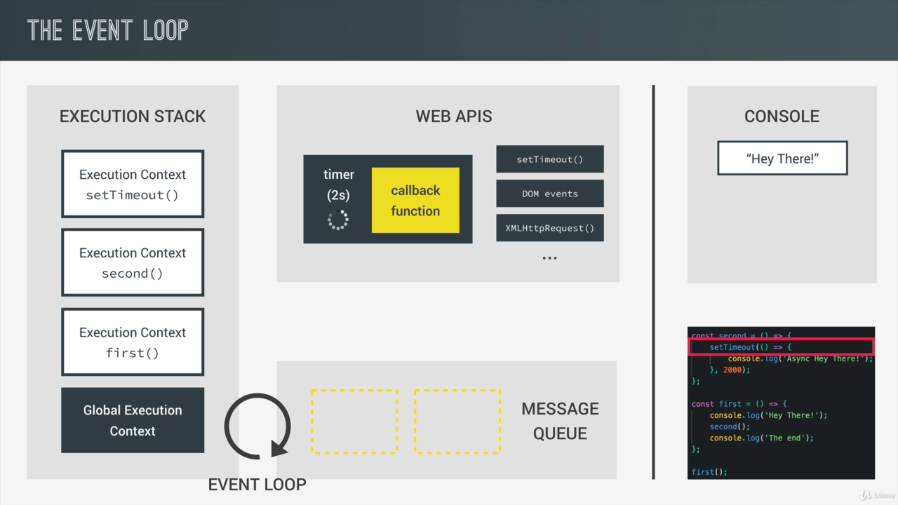
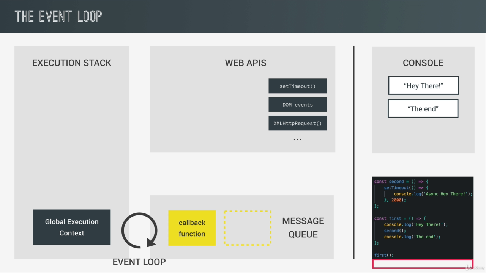
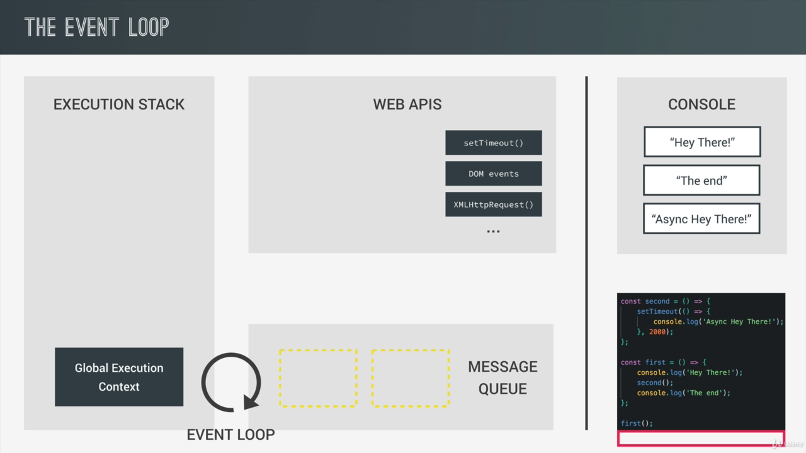

# Asynchronous JavaScript: Promises, Async/Await and Ajax:

- Async codes Keeps running on the background while our main code is still executing
- Use Cases: Requesting Some Data from a remote server, like an API.

## An Example of Asynchronous JavaScript:

- We have used the `setTimeout()` function here.
- This function has a callback function and the time of delay in millisecond as an argument

```html
<script>
  const second = () => {
    setTimeout(() => {
      console.log("Async Hey there");
    }, 2000);
  };

  const first = () => {
    console.log("Hey There!");
    second();
    console.log("The End");
  };

  first();
</script>
```

- The setTimeout() is an async function, it doesn't run sequentially.
- Here is the output of above code:

```js
Hey There!
The End
Async Hey there
```

- Although we would expect "Async Hey There" to appear before the "The End", it doesn't work that way in async programming.

## Understanding Asynchronous JavaScript The Event Loop:

- Synchronous: Sequential, one instruction after another.
- Asynchronous: Doesn't wait for line to execute to go to next line.

### Main Idea behind async:

- Allow asynchronous functions to run in the "background"
- We pass in callbacks that run once the function has finished its work
- Move on immediately Non-blocking!
- Example:

```js
const image = document.getElementByID("img").src;

processLargeImage(image, () => {
  console.log("Image Processed~");
});
```

- We can defer actions to the future.

### Under the Hood (Event Loop):

- Event Loop, Web Apis, Execution Stack and Message Queue together make a JS runtime.
- This runtime is responsible for how JS runs behind the scenes as it executes the code.

```html
<script>
  const second = () => {
    setTimeout(() => {
      console.log("Async Hey there");
    }, 2000);
  };

  const first = () => {
    console.log("Hey There!");
    second();
    console.log("The End");
  };

  first();
</script>
```

- In this code, when first() is called, it gets its execution stack.
- Then inside first() console.log() is called and it also gets its Execution Stack. Then text is logged to console, then function returns then it pops from the stack.
- Then execution context is created by second() function. Inside which setTimeout() is called. Which also gets its execution stack.
- setTimeout() function comes from the web apis which lives separate from JS engine.
- web apis: stuffs like DOM manipulation methods, setTimeout(), httprequest for ajax, geo location, local storage live outside of JS engine and we can access them because they are part of a runtime. This is exactly where the timer will keep running without being blocked.
- When we call setTimeout function, timer is created together with callback function inside the web apis environment. It sits there until it finishes its work. Call back function is not called until the timer finishes.
- Since the timer keeps working in the background, we dont have to wait and keep on executing our code.



- The setTimeout() function returns, pops up the stack, and so does the execution context of the second function.
- It reaches the log with "The End" which it prints on console after being added to stack and pop the console's stack
- The first() function returns and we are back to original state
- Now the timer has passed then the callback function moves to message queue



- This is exactly what happens for DOM events as well.
- In case of DOM events our events sit in the web apis waiting for a certain event to happen.
- As soon as the event happens that callback is placed on the message queue ready to be executed.

### Executing callback functions in the message queue:

- The job of the event loop is to constantly monitor Execution Stack and the message queue and push the callback function to the execution stack as soon as the stack is empty.
- Since the stack is empty now, the callback is now pushed to the execution stack, then the log of the callback function is place and then logged to the console and then popped from the stack.
- If there were some more callbacks waiting right now like data coming back from ajax requests or the handler of a dom event then the event loop would continue pushing them to the event stack untill all of them were processed.

### Final State:



## The Old Way Asynchronous JavaScript with Callbacks:

- Traditional way

### Nested `setTimeout()`:

- **Simulation** of loading data from ajax call is done here.
- First we get the recipe id.
- Once the ID is obtained we fetch the recipe, this process is simulated by yet another `setTimeout()` function.
- `setTimeout()` takes third argument which can be supplied to callback function
- Again if we want the recipe by same publisher, we can do as follows.

```js
function getRecipe() {
  setTimeout(() => {
    const recipeID = [523, 883, 432, 974];
    console.log(recipeID);
    setTimeout(
      (id) => {
        const recipe = {
          title: "French Tomata Pasta",
          publisher: "Jonas",
        };
        console.log(`${id} : ${recipe.title}`);
        setTimeout(
          (publisher) => {
            const recipe2 = {
              title: "Italian Pizza",
              publisher: "Jonas",
            };
            console.log(recipe2);
          },
          1500,
          recipe.publisher
        );
      },
      1500,
      recipeID[2]
    );
  }, 1500);
}

getRecipe();
```

- What we implemented here was similar to a three chained ajax call
- There is setTimeout inside setTimeout, but after a while it will get quite tedious as the chain increases.
- There are calbacks inside of other callbacks. This is often called the callback hell in javascript.
- To overcome the **callback hell**, **promises** were introduced in ES6.

## From Callback Hell to Promises:

- ES6 feature to deal with async JS

### What are Promises?:

- Object that keeps track about whether a certain event(_asynchronous_) has happened already or not.
- Determines what happens after the event(_asynchronous_) has happened
- Implements the concept of a future value that we're expecting. (EG: We Ask to Get data from server in the background, promise the promises us to get that data, we can handle it in the future.)

### Promise States:

#### Pending:

- Before the state has happened the promise is called _pending_

#### Settled/Resolved:

- Promise after the state has _happened_.

#### Fulfilled:

- When the promise is successful and the result is obtained, it is called _fulfilled_.

#### Rejected:

- When the promise is unsuccessful and the result is not obtained, it is called _rejected_.

---

We can produce and consume promises. When we produce a promise we create a new promise and send a result using that promise. When we consume it, we can use the callback function for fulfillment/rejection of promise.

### Code Sandbox:

- Code for Getting IDs with promise.

```js
const getIDs = new Promise((resolve, reject) => {
  setTimeout(() => {
    resolve([523, 883, 432, 974]);
  }, 1500);
});

getIDs.then((IDs) => {
  console.log(IDs);
});
```

- OP: `(4) [523, 883, 432, 974]`

#### Executor Function

- We created a Promise() object with a executor function inside of it.
- Executor function takes two arguments: `resolve` and `reject` functions
- Executor function informs the promise whether the event it is handling was successful or not. If it was successful we call `resolve()` else we call `reject()`
- Executor function is immediately called once the Promise is created.
- Inside the executor we placed a async code.
- After 1500 ms `setTimeout` returns the array of fake ids in case it is successful, utilizing the `resolve()` function
- What we pass as an argument while calling `resolve()` is the **result of the promise.**
- Since `setTimeout()` is always successful we can only place the `resolve()` function, for the cases where success isn't guaranteed, we should include the `reject` functions too.
- resolve returns data from the successful/fulfilled promise.
- We handle the fulfilled state with the `then()` method.

#### `then()` method:

- Available on all promise objects.
- Used to handle the fulfilled promise or **consume** the promise.
- Adds event handler for the case of fulfilled promises (there exists a result).
- Pass a callback function which has the result of successful promise as its argument.

#### `catch()` method:

- Handles promise when it is rejected.
- Second method to **consume** the promise

```js
const getIDs = new Promise((resolve, reject) => {
  setTimeout(() => {
    reject([523, 883, 432, 974]);
  }, 1500);
});

getIDs.catch((error) => {
  console.log(error);
});

// (4) [523, 883, 432, 974]
```

### Chaining different promises:

```js
const getIDs = new Promise((resolve, reject) => {
  setTimeout(() => {
    resolve([523, 883, 432, 974]);
  }, 1500);
});

const getRecipe = (recID) => {
  return new Promise((resolve, reject) => {
    setTimeout(
      (ID) => {
        const recipe = {
          title: "French Tomata Pasta",
          publisher: "Jonas",
        };
        resolve(recipe);
      },
      1500,
      recID
    );
  });
};

const getRelated = (publisher) => {
  return new Promise((resolve, reject) => {
    setTimeout(
      (pub) => {
        const recipe = {
          title: "Italian Pizza",
          publisher: "Jonas",
        };
        resolve(`${pub}: ${recipe.title}`);
      },
      1500,
      publisher
    );
  });
};
getIDs
  .then((IDs) => {
    console.log(IDs);
    return getRecipe(IDs[2]);
  })
  .then((recipe) => {
    console.log(recipe);
    return getRelated(recipe.publisher);
  })
  .then((recipe) => {
    console.log(recipe);
  })
  .catch((error) => {
    console.log("Error!");
  });
```

#### Explanation:

- We call `getID's` `then()`, which does the job(Async, with timer), logs the id and returns the return value of `getRecipe()`
- `getRecipe()` returns promise and this returned promise's `then()` function is called. `then()` recieves the recipe and logs it to console. `then()` returns the return value of `getRelated()`.
- `getRelated()` returns a promise with resolve value of recipe, which the `then()` function logs to the console.

## From Promises to AsyncAwait:

- Introduced in ES8
- Purpose is to consume Promises they do not produce them
- Method of Producing promises is same as before

### Process:

- Start by creating async function using the `async` keyword:

```js
async function getRecipesAW() {}
```

- The async function returns a promise.
- Inside async function we can have one or more `await` expressions

```js
async function getRecipesAW() {
  const IDs = await getIDs;
  console.log(IDs); // (4) [523, 883, 432, 974]
}
```

- `await` keyword holds execution until the promise is fulfilled. And the expression return the resolved value of the promise and it is assigned to IDs here in the above code

- Multiple awaits:

```js
async function getRecipesAW() {
  const IDs = await getIDs;
  console.log(IDs); // (4) [523, 883, 432, 974]
  const recipe = await getRecipe(IDs[2]);
  console.log(recipe);
  const related = await getRelated(recipe.publisher);
  console.log(related);
}
```

- `await` expression can only be used inside a async function.
- async function runs in the background which is very important because we cannot have the main code stopping
- although we must synchronously invoke the `getRecipesAW()` from somewhere in the program.

### Returning values from Async function:

```js
async function getRecipesAW() {
  ....................
  return recipe;
}

const rec = getRecipesAW();
console.log(rec);
/*

Output:

Promise {<pending>}
(4) [523, 883, 432, 974]
{title: "French Tomata Pasta", publisher: "Jonas"}
Jonas: Italian Pizza

*/
```

- Cannot return synchronously, when the rec = getRecipesAW() is executed the async function is not yet complete. So, it doesn't reach to the return statement. But it does return a promise pending object
- An async function always automatically returns a promise.
- Returning something will resolve the promise with returned value.

```js
getRecipesAW().then((result) => {
  console.log(result);
  // {title: "French Tomata Pasta", publisher: "Jonas"}
});
```

- Sinc the function returns a promise we can consume the returned value as resolved value.
