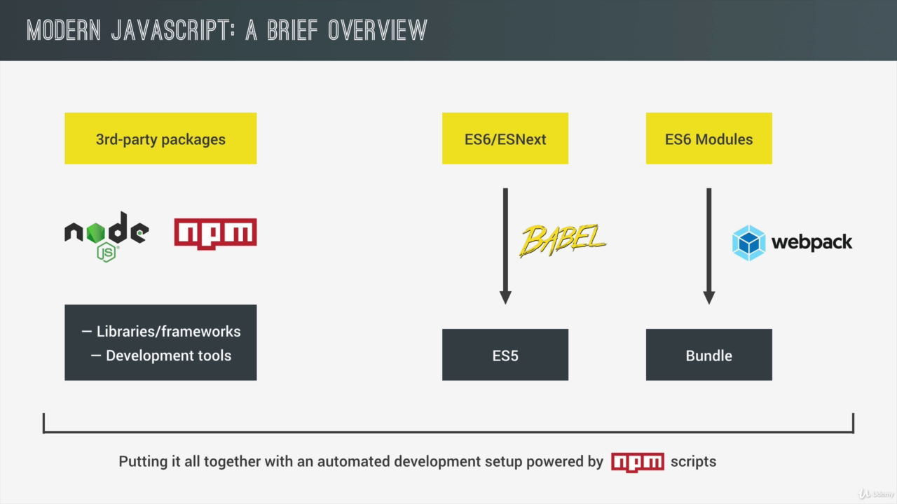
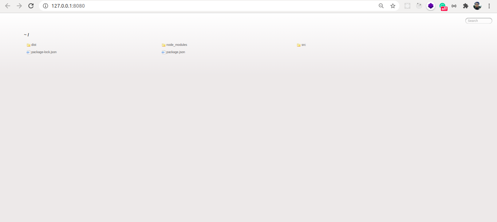
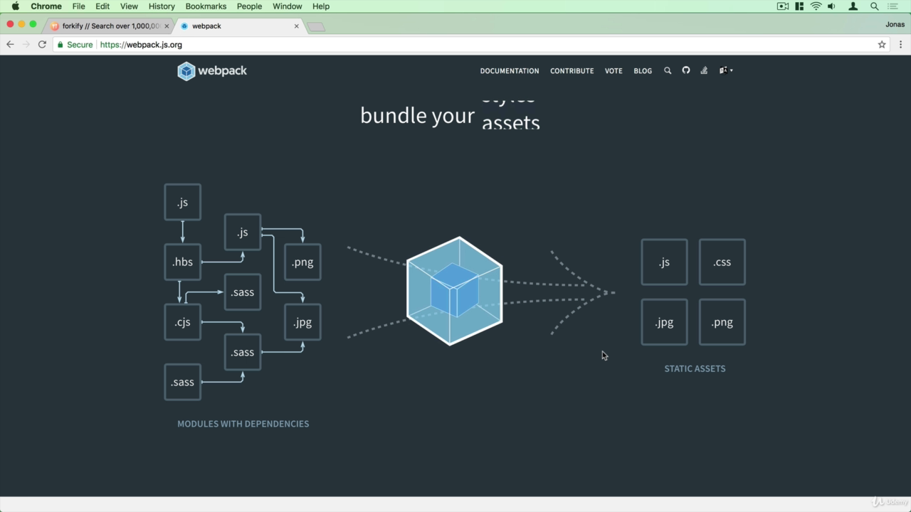
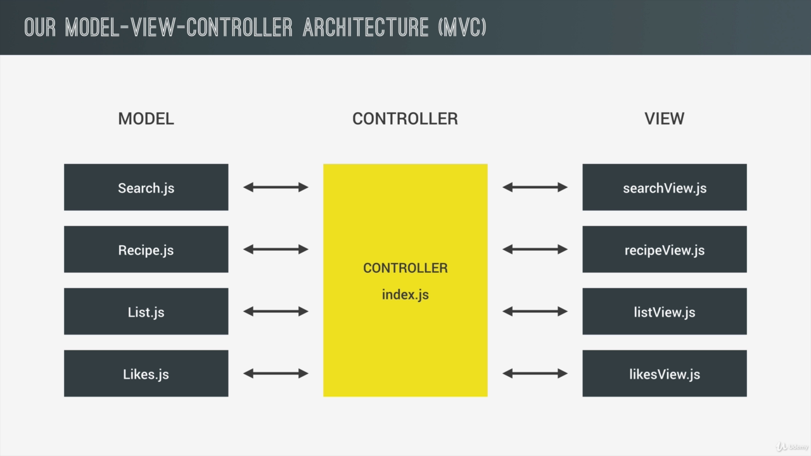
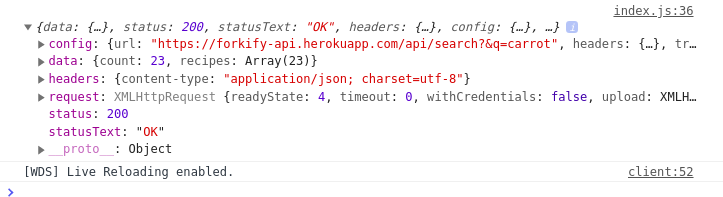
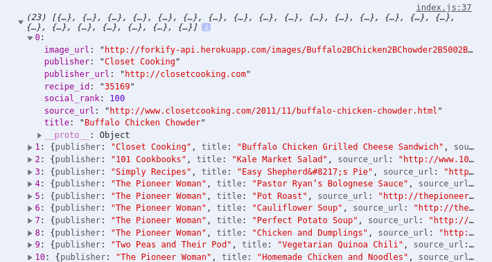

# Modern JavaScript Using ES6, NPM, Babel and Webpack

- Real life API consuming App
- **Webpack** to bundle JS modules
- **Babel** to transpile ES6 to ES5
- Modern Workflow for JS

## Project Overview:

- Recipe Searching App (Uses Api to fetch recipe)
- Recipe List
- Like Recipe
- View Recipe
- Add to Cart
- Local Storage

## An Overview of Modern Javascript:

- We compile ES6 and newer versions to ES5, use module bundlers, task runners, external packages and other dev tools

### A brief overview:

- More than language, also the environment where we run the code.
- Tools to make it easier and better to work with
- Foundation of these tools are node js and npm ecosystem, where we can find all sorts of third party open source tools, libraries and frameworks.
- Libs and Frames : Angular, React, Loadash, Jquery
- Tools : Task Automations, Automatic Browser reloading, Compile ES5 to ES6
- NPM helps us to manage these packages.
- NPM is a simple CLI that manages these tools and libs and it also allows us to write scripts to use our dev tools .

### Babel:

- ES5/ESNext --------> ES5

### Webpack:

- ES6 Modules ----------> Bundle
- We can separate different parts of our app to different files.
- ES6's modules is not supported by Browsers so we use the module bundler to bundle the modules together into a single file.
- Can do more than bundling:

#### Task:

- Codesplitting
- Loading many types of assets like SASS or Images
- Decreasing JS bundle Size using the treeshaking algorithm

### Conclusion

These are NPM packages and the easiest way to run them is by using NPM script. Which allows us to run all these tools automatically and easily in our CLI.



## A Brief Introduction to the Command Line:

- These Tools only work in the command line
- Moving around the File System, Creating Files and Folders, copying files and so on.

```bash

rm
# removes

rm -r
# removes directory

mv
# moves

cp
# copies

open
# opens file

```

## A modern Setup Installing Node.js and NPM:

- Install node
- Add package.json: `npm init`

### Installing Webpack using npm:

`npm install webpack --save-dev`

- `--save-dev` to save as development dependency
- In `package.json` we see the line:

```json
  "devDependencies": {
    "webpack": "^4.44.0"
  }
```

- Which implies that webpack is a development tool.

### Installing Jquery(Example)

- `npm install jquery --save`
- Package.json:

```json
  "dependencies": {
    "jquery": "^3.5.1"
  }
```

- Not a dev dependencies but just a dependency.
- Dependency are important because they let our code run on other dev's pc
- Dependencies allow us to install all the dependencies automatically.

### Node Modules:

- All packages, and the dependencies required for each dependencies is present here (Jquery and Webpack in our case)

### Adding Dependencies:

- There is list of dependencies in the package.json file which we can use to install the dependencies.

`npm install`

#### Uninstalling packages:

`npm uninstall jquery`

### Installing Packages Globally:

- `--save-dev` and `--save` options installs packages locally.
- Accesible from everywhere.
- A package called **Liveserver** creates local server to serve static website.
  `sudo npm install live-server --global`
- Now we can run the `live-server` command from literally anywhere, since it is installed globally

```bash
bomb@zod:~/Documents/projects/javascript/completejscourse_work_codes/9-forkify/starter$ live-server
Serving "/home/bomb/Documents/projects/javascript/completejscourse_work_codes/9-forkify/starter" at http://127.0.0.1:8080
Ready for changes
GET /favicon.ico 404 3.490 ms - 150
```



## Babel Installation:

[ref](notes-images/tools6.html)

`npm install --save-dev @babel/core @babel/preset-env babel-loader`

`npm install --save core-js@3 regenerator-runtime`

## A Modern Setup Configuring Webpack:

- Bundling with webpack:



- Bundles more than `.js` files

### Zero Configuration:

- No need to write config file
- You need to have one source folder in the root and a single index.js file then you are good to go.
- Webpack create a distribution folder and puts the bundled files there.
- That's for small app, for larger app we'll write cofiguration.

### Webpack Config File:

- Create `webpack.config.js` in root of project
- It is a regular js file
- We have one object where we specify our configuartion.
- We export this object from this file using the nodeJS syntax.
- Webpack can take this object and work with it.

#### Core Concepts in Webpack:

1. **Entry Points** : Where the webpack will start bundling. The location to the file where it will look up all the dependencies that it will bundle up together. We can specify one or more entry files. But here we are specifying only one for now i.e. index.js for now.

```js
module.exports = {
  entry: ["./src/js/index.js"],
};
```

2. **Output** : Tells webpack where to save the bundled files. Specify the output property by passing an object. In the object put the path to the folder and the filename. Filename is usually `bundle.js`. The path needs to be an absolute path. To access the absolute path we use the built-in node package called path which we import as : `const path = require("path");`. The `resolve()` method inside the path package requires `__dirname` variable to obtain the absolute path and we append the output folder's path as second parameter to the `resolve()` method.

```js
const path = require("path");

module.exports = {
  entry: ["./src/js/index.js"],
  output: {
    path: path.resolve(__dirname, "dist/js"),
    filename: "bundle.js",
  },
  mode: "development",
};
```

- We can also specify the mode as production or development. Development mode doesn't create a minified version of code. The production mode will enable all sorts of optimization like minification and treeshaking in order to reduce the final bundle size.

3. **Loaders** TBRL
4. **Plugins** TBRL

### Exporting Modules:

#### test.js

- `export` is the ES6 modules syntax
- We can have `default` export or a named export

```js
console.log("Imported Module");
export default 23;
```

#### index.js

- We can import something using the `import` keyword and assign it to a variable say `x`.
- We can name the modules we are importing from as: `'./test'` . We dont have to specify `.js`

```js
import x from "./test ";

// x is what we exported from test.js

console.log(`I imported ${x} from another module`);
```

### Adding npm script:

- Install the `webpack-cli` as : `npm install webpack-cli --save-dev`
- Specify the script in package.json:

```json
  "scripts": {
    "dev": "webpack"
  },
```

### Running the webpack:

`npm run dev`

- run starts the scripts.

### Testing our code:

- Go to dist, create a new index.html file and import the bundle.js script and inspect the element.
- Output:

```console
Imported Module             test.js:2
I imported 23 from another module       index.js:8
```

- If we didn't use the webpack it wouldn't have worked.

### Adding mode to npm script:

```json
  "scripts": {
    "dev": "webpack --mode development",
    "build": "webpack --mode production"
  },
```

- Remove the mode from webpack.config.js and add it to scripts of package.json instead in a way as specified above.
- Running `npm run build` yields in a `bundle.js` file quite smaller than `npm run dev` since we are building in production mode.

## A Modern Setup The Webpack Dev Server:

- Adding webpack dev server to our setup in order to automatically reload the page when we save our code.

### Installation:

`npm install webpack-dev-server --save-dev`

- Specify the contentBase in `webpack.config.js`:

```js
devServer: {
  contentBase: "./dist";
}
```

- We also add a `start` script in `package.json`

```json
  "scripts": {
    "dev": "webpack --mode development",
    "build": "webpack --mode production",
    "start": "webpack-dev-server --mode development --open"
  },
```

- `--open` flag opens the file in browser automatically

- run the command: `npm run start`

- And we are good to go. The index.html is opened, the one inside the dist folder.
- Now we can monitor any changes

#### Slight Correction :

- Specify path to the folder where webpack bundles and specify the filename relative to that path

```js
module.exports = {
  entry: ["./src/js/index.js"],
  output: {
    path: path.resolve(__dirname, "dist"),
    filename: "js/bundle.js",
  },
  devServer: {
    contentBase: "./dist",
  },
```

- ContentBase and Path is made the same so the web-pack-dev server works properly to automatically reload the changes.

### Copying index.html to dist:

- Webpack allows us to do the copying and it also injects the script tags.
- For this purpose we have the plugins.

#### Plugins:

- Plugins allows us to do the complex processing of our input files. In our case, `index.html` file.
- We want to use the html webpack plug-in
- First we have to install it.

```js
npm i --save-dev html-webpack-plugin
```

- Configuring in `webpack.config.js` :

```js
const path = require("path");
const HtmlWebpackPlugin = require("html-webpack-plugin");

module.exports = {
  .............
  plugins: [
    new HtmlWebpackPlugin({
      filename: "index.html",
      template: "./src/index.html",
    }),
  ],
};
```

- We have to require the plugin as we did before for path
- We have to specify in the array all the plugins that we are using.
- We pass `HtmlWebpackPlugin` object, inside of which we pass an option in the form of js object.
- Since we want to copy index.html each time we are bundling from src to dist, we specify the filename and template.
- Template is the starting HTML file.

### NPM START:

- index.html file is not present in the dist folder.
- The webpack dev server streams the file
- On inspecting element we notice that plugin inject the line :

```html
<script src="js/bundle.js"></script>
```

### NPM DEV:

- Bundles the files and puts it to dist

## A Modern Setup Babel:

- Babel is a JavaScript Compiler

### Packages Needed:

- `npm install --save-dev @babel/core @babel/preset-env babel-loader`
- Installing multpile packages at once.
- Babel loader is needed for webpack to load babel files
- Preset to compile js.
- Core contains the core functionality of the compiler.

### Loaders:

- Loaders in webpack allow us to import or to load all kinds of different files and also to process them (like converting SASS to CSS code, ES6 to ES5)
- Including loader in webpack.config.js

```js
..................
module.exports = {
.................
  module: {
    rules: [
      {
        test: /\.js$/,
        exclude: /node_midules/,
        use: {
          loader: "babel-loader",
        },
      },
    ],
  },
};
```

- We specify `module` property and assign an object
- We have `rules` inside this object which is an array
- the array contains an object with `test` and `use` property
- `test` contains regular expression that includes all js files
- `use` has an object with `loader` property where we specify the `babel-loader`.
- We `exclude` the `node_modules` using regex else babel will compile all `node_modules` thousands of js files.
- What rule does is it specifies babel to check .js and exclude node_modules and apply babel loader to this file.

### Babel Config File (.babelrc):

- We have object with preset property
- Into preset we pass an array
- Preset is a collection of code transform plugins which in our case is @babel/env
- Now we can target the environment, like browsers

```json
{
  "presets": [
    [
      "@babel/env",
      {
        "useBuiltIns": "usage",
        "corejs": "3",
        "targets": {
          "browsers": ["last 5 versions", "ie >= 8"]
        }
      }
    ]
  ]
}
```

- Babel automatically figures out which version of JS it needs to run on last five version of all the browsers.
- Somethings we cannot convert since they are not present in ES5, these need to be polyfilled.
- For polyfill we install core-js and regenerator-runtime for async.

- `npm install --save core-js@3 regenerator-runtime`

- These are installed in app dependencies and they are going into final bundle.

## Planning our project Architecture:

- We are using the Model-View-Controller architecture (MVC)
- MVC very nicely decouples the presentation logic from the application logic with the controller in between them that control the entire app.
- **Controller** - index.js file. Possible due to ES6 modules that makes the app modular separating different aspects of the app into different files.
- We'll have separate models and view for each of the different aspects of the app.
- search.js model is responsible for fetching apis, doing search using ajax.
- In view.js we take the user input from the UI, and display the search results.
- controller connects these models and view.
- similarly there are recipe, list and likes part of the app with their respective MVC component.



## How ES6 Modules Work:

### Content:

- How to use ES6 modules
- Default and named exports and imports

### Creating Files:

- src -> models -> Search.js
- src -> views -> searchView.js

### Default Exports:

- Used only when we wabt to export one thing from a module.
- Exporting:

```js
// models/Search.js
export default "I am an exported string";
```

- Importing:

```js
// index.js
import string from "./models/Search";
```

### Named Exports:

#### Multiple Exports:

```js
// view/searchView.js

export const add = (a, b) => a + b;
export const multiply = (a, b) => a * b;
export const ID = 23;
```

#### Multiple Imports:

```js
// index.js
import { add, multiply, ID } from "./views/searchView";
console.log(
  `Using imported function: ${add(ID, 2)} and ${multiply(3, 5)}, ${str}`
);
// Using imported function: 25 and 15, I am an exported string
```

- We have to use exact same name or we can use different name as :

```js
// index.js
import { add as a, multiply as m, ID } from "./views/searchView";
console.log(`Using imported function: ${a(ID, 2)} and ${m(3, 5)}, ${str}`);
```

- Importing all :

```js
import * as searchView from "./views/searchView";

console.log(
  `Using imported function: ${searchView.add(
    searchView.ID,
    2
  )} and ${searchView.multiply(3, 5)}, ${str}`
);
```

## Making Our First API Calls:

### Content:

- How to use a real world API
- What API keys are and why we need them

### API keys:

- Like Passwords
- Helps to track number of requests.
- Example api with keys :

```js
const res = await axios(
  `${PROXY}http://food2fork.com/api/search?key=${KEY}&q=${this.query}`
);
```

### Sample API call:

- Since fetch is not compatible with all browsers we can use the axios:
  `npm install axios --save`

- **Importing Packages** : No need to specify the path of npm package like we specified ES6 modules path while importing.

```js
import axios from "axios";

// variations:
import a from "axios";
```

- axios automatically returns json, but with fetch we had two steps. It also handles error better.

### Result of ajax:

- Code:

```js
import axios from "axios";

async function getResults(query) {
  const res = await axios(
    `https://forkify-api.herokuapp.com/api/search?&q=${query}`
  );
  console.log(res);
}

getResults("carrot");
```

- Console pic:



- JSON response is observed with data, config, header and so on.

- Obtaining only recipe data:

```js
const recipes = res.data.recipes;
console.log(recipes);
```



### Error Handling:

- Use the try catch

```js
import axios from "axios";

async function getResults(query) {
  try {
    const res = await axios(
      `https://forkify-api.herokuapp.com/api/search?&q=${query}`
    );
    const recipes = res.data.recipes;
    console.log(recipes);
  } catch (error) {
    alert(error);
  }
}

getResults("carrot");
```

## Building the Search Model:

### Content:

- How to build a simple data model using ES6 Classes

### Data:

- Implementation of Query + Search Result

```js
//Search.js
import axios from "axios";

export default class Search {
  constructor(query) {
    this.query = query;
  }
  async getResults() {
    try {
      const res = await axios(
        `https://forkify-api.herokuapp.com/api/search?&q=${this.query}`
      );
      this.result = res.data.recipes;
      console.log(this.result);
    } catch (error) {
      alert(error);
    }
  }
}
```

- Note how we dynamically created a new property called `result` inside the method of a class without defining the method in a constuctor.

```js
//index.js
import Search from "./models/Search";

const search = new Search("pizza");
console.log(search);

/*
Search {query: "pizza"}
query: "pizza"
__proto__:
constructor: ƒ Search(query)
getResults: ƒ getResults()
__proto__: Object
*/

search.getResults();

/*
(28) [{…}, {…}, {…}, {…}, {…}, {…}, {…}, {…}, {…}, {…}, {…}, {…}, {…}, {…}, {…}, {…}, {…}, {…}, {…}, {…}, {…}, {…}, {…}, {…}, {…}, {…}, {…}, {…}]
*/
```

- Both query and result are inside the search object now.

## Building the Search Controller:

### Content:

- The concept of application state
- A simple way of implementng state

We are going to place all the controller's code in a single file.

### State:

- What is the current state of the app? Like what is the current search query or current recipe, How many servings are currently being calculated, What's currently in the shopping list.
- All of these data in the current moment in our app is call state
- We'd like to store these state in one central variable, like an object
- State Management Libraries eg: Redux

### Code With Explanation:

- Create a state object (Don't why constant)
- All the state variable will be held by this object

```js
import Search from "./models/Search";

////////////////////////////////////////
/** Global state of the app
 * - Search Object (Query + Result)
 * - Current Recipe Object
 * - Shopping List Object
 * - Liked Recipe
 */
const state = {};
////////////////////////////////////////

const controlSearch = async () => {
  // 1. Get the Query from the view
  const query = "pizza"; //TODO

  if (query) {
    // 2. New Search object and add to state
    state.search = new Search(query);

    // 3. Prepare UI (Clear Previous result, load spinner display)
    /** */

    // 4. Search for recipe
    await state.search.getResults();

    // 5. Render Results in UI
    console.log(state.search.result);
  }
};
// Selecting the form and passing event object to Callback function
document.querySelector(".search").addEventListener("submit", (e) => {
  e.preventDefault(); // To prevent from reloading when form is submitted
  controlSearch();
});

/**
 * (28) [{…}, {…}, {…}, {…}, {…}, {…}, {…}, {…}, {…}, {…}, {…}, {…}, {…}, {…}, {…}, {…}, {…}, {…}, {…}, {…}, {…}, {…}, {…}, {…}, {…}, {…}, {…}, {…}]
 */
```

#### Algorithm

- Listen to search form submit event
- Read the Query from the view
- Create a new search object with that query
- Prepare the UI for the query
- Prepare the recipe from json data using search object's method
- Render the result in UI
